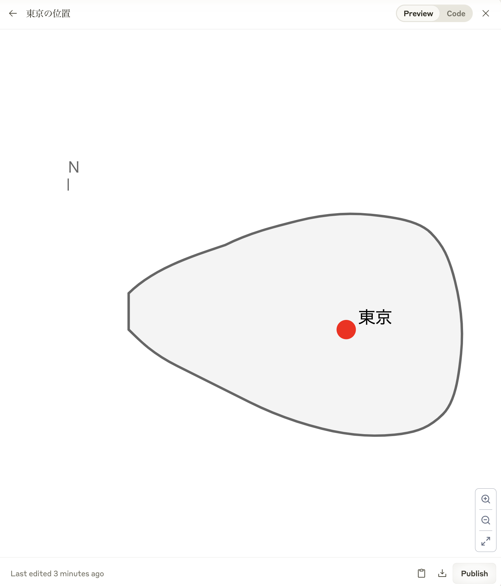
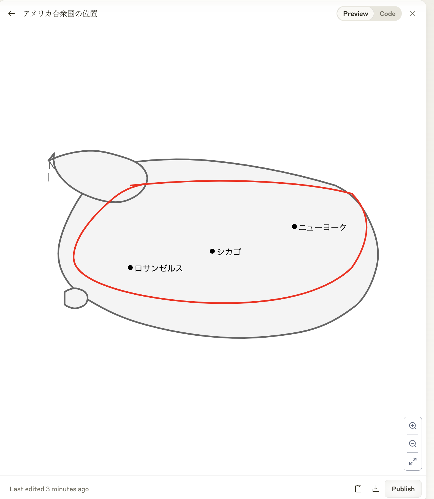
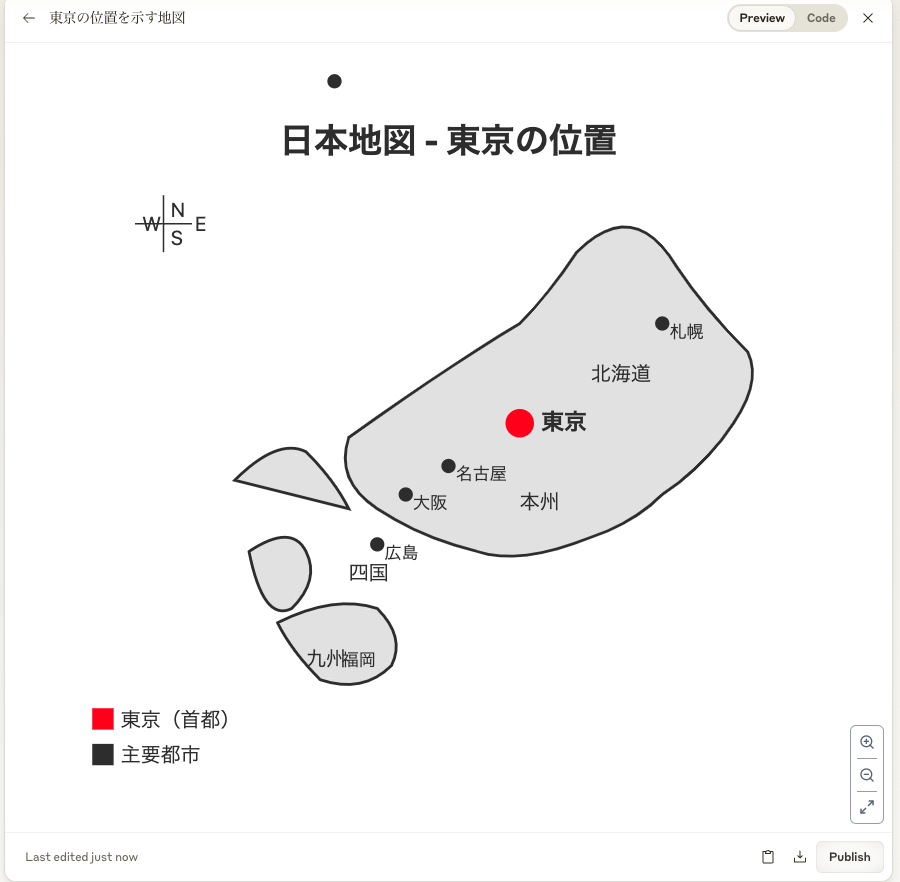
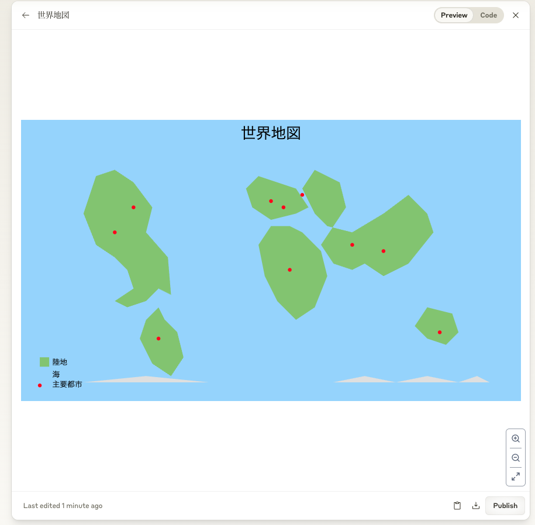
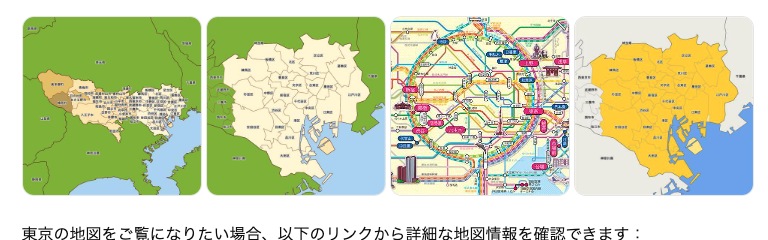
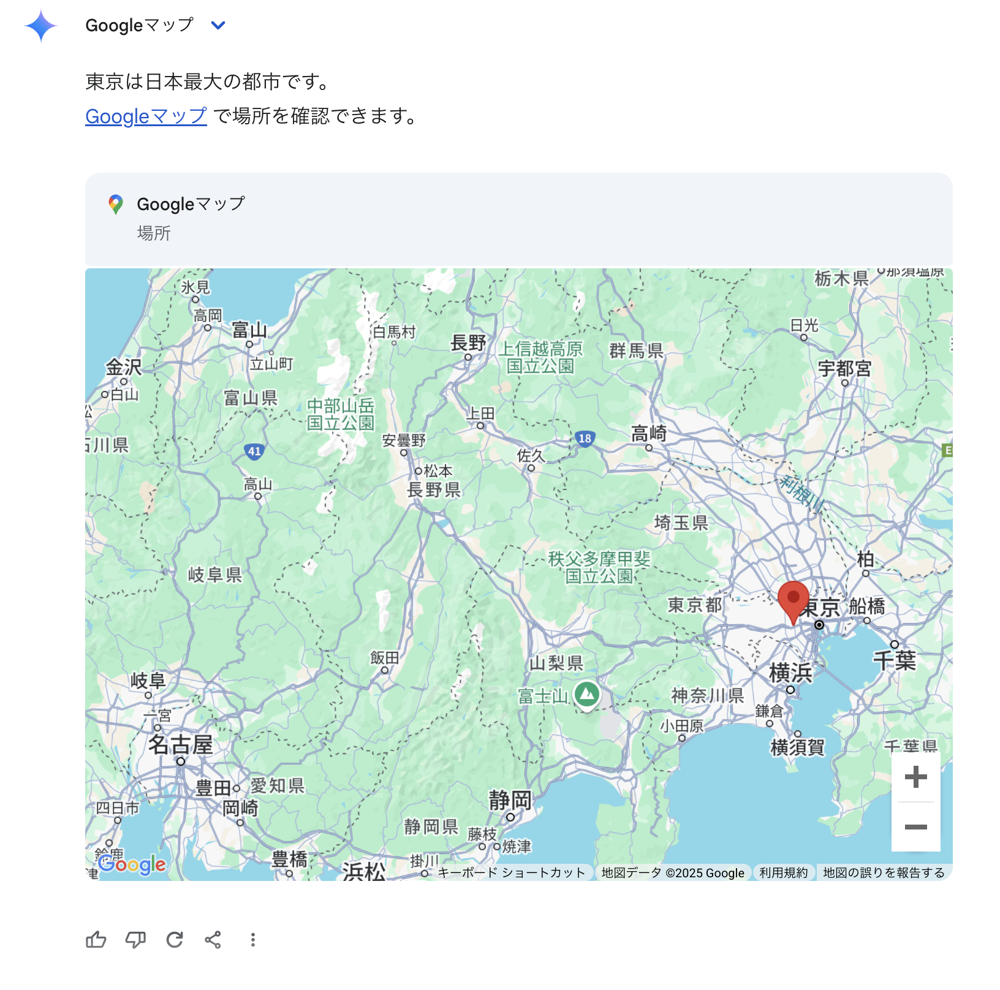

# 概要

LLM に投げたら面白そうなタスクを投げて比較してみたときのメモ。
今回は地図。意図としては、現状の LLM は視覚的な表現をどれくらい扱えるのか、ということを知りたかった。

ベースの質問は「東京の場所を示してください」

# Claude 3.5 sonnet

2025-02-03 に試した。

> 東京は本州の関東平野に位置する日本の首都です。地図上の赤い点で示されている通り、太平洋側に面しており、日本のほぼ中央部に位置しています。
> 東京は以下の地域と接しています：
>
> - 北側：埼玉県
> - 東側：千葉県
> - 西側：山梨県
> - 南側：神奈川県
>
> また、東京湾にも面しており、地理的にも経済的にも日本の中心的な位置を占めています。

> 

Claude は SVG を生成して、視覚表現を出力しようとする。
その結果、悲惨な画像になってしまった。

米国の場所のほうが詳しいかと思い、「アメリカの場所を示してください」とも聞いてみた。

> アメリカ合衆国は北米大陸に位置する連邦共和国です。地図に示されている通り、以下の特徴があります：
> 主な地理的特徴：
>
> - 北側：カナダと国境を接しています 南側：メキシコと国境を接しています
> - 東側：大西洋に面しています 西側：太平洋に面しています
> - また、本土から離れた地域として： アラスカ州（北西部） ハワイ州（太平洋上）
>
> があります。アメリカは世界第3位の国土面積を持ち、多様な地形や気候帯を含んでいます。赤い線で示された本土部分には、主要都市として示したニューヨーク、シカゴ、ロサンゼルスなどが位置しています。
> 

結果は変わらず、悲惨な SVG が生成された。
グラフの出力には強いので、うまく使い分けができればといったところだろう。

# Claude 3.7 Sonnet

2025-02-25 に試した。

> 東京は日本の本州島の東部に位置しています。日本の首都であり、関東平野の南部、東京湾に面した場所にあります。
> 具体的な位置を示すと、東京の中心部はおよそ北緯35度41分、東経139度46分に位置しています。
> 東京は23区（特別区）、多摩地域（26市、3町、1村）、島しょ部（2町、7村の島々）から構成されており、日本の政治、経済、文化の中心地となっています。

勝手に地図を出力しなくなっていたため、「地図で示すことはできますか？」と促してみる。
ちなみに、[e-Stat](https://www.e-stat.go.jp/municipalities/number-of-municipalities?year=2025&month=2&day=25&file_format=csv&sort_key=tokubetuCnt&sort_order=desc&form_id=city_count_form)
で確認したところ、東京に含まれる市町村の数は、2025-02-25
現在、23区26市1郡5町8村であり、正しい。

> 東京の位置を地図で示します。
>
> 
>
> この地図では、日本列島の中で東京の位置を赤い丸で示しています。東京は本州の東部、太平洋側に位置しています。
> 他の主要都市（名古屋、大阪、広島、札幌、福岡）も参考のために表示しています。東京は日本の首都であり、政治・経済・文化の中心として機能しています。
> より詳細な地図が必要な場合や、東京23区内の特定の場所についてお知りになりたい場合は、お知らせください。

進歩は見られる。ただし、まだ悲惨な地図と言われてしまう範囲にはある。

試みに新しくチャットを作って、「世界地図を見たいです」と投げてみた。

> 世界地図をお見せします。SVGで簡単な世界地図を作成しました。
>
> 
>
> こちらが簡単な世界地図です。主要な大陸（北米、南米、ヨーロッパ、アフリカ、アジア、オーストラリア、南極大陸）と、いくつかの主要都市（ニューヨーク、ロサンゼルス、ロンドン、パリ、モスクワ、北京、東京、シドニー、カイロ、リオデジャネイロ）を表示しています。
> もし特定の地域や国に焦点を当てた地図や、もっと詳細な情報が必要でしたら、お知らせください。

実際の SVG は以下のようになっている。
コードは、コメントがきちんとついて綺麗なんだけど。 ちなみに、この SVG は拡大縮小ができるので、SVG の利点が活かされている。

```svg
<svg xmlns="http://www.w3.org/2000/svg" viewBox="0 0 800 450">
  <!-- 背景（海） -->
  <rect width="800" height="450" fill="#a5d8ff"/>
  
  <!-- 大陸 -->
  <!-- 北米 -->
  <path d="M150,80 L120,90 L100,150 L120,200 L150,220 L170,240 L180,270 L150,290 L170,300 L200,290 L220,270 L240,280 L235,220 L200,180 L210,140 L180,100 Z" fill="#91cb75"/>
  
  <!-- 南米 -->
  <path d="M220,300 L200,320 L190,350 L210,390 L240,410 L260,380 L250,340 L230,320 Z" fill="#91cb75"/>
  
  <!-- ヨーロッパ -->
  <path d="M380,90 L360,110 L370,140 L400,160 L440,150 L460,140 L440,110 L410,100 Z" fill="#91cb75"/>
  
  <!-- アフリカ -->
  <path d="M400,170 L380,200 L390,250 L410,290 L440,320 L470,300 L490,250 L480,210 L450,180 L430,170 Z" fill="#91cb75"/>
  
  <!-- アジア -->
  <path d="M470,80 L450,110 L470,150 L490,170 L530,180 L580,150 L620,120 L650,150 L660,180 L620,230 L580,250 L550,230 L530,240 L500,230 L480,200 L500,170 L520,140 L510,100 Z" fill="#91cb75"/>
  
  <!-- オーストラリア -->
  <path d="M650,300 L630,330 L650,350 L680,360 L700,340 L690,310 Z" fill="#91cb75"/>
  
  <!-- 南極大陸 -->
  <path d="M300,420 L500,420 L550,410 L600,420 L650,410 L700,420 L730,410 L750,420 L100,420 L200,410 Z" fill="#e3e3e3"/>
  
  <!-- 主要都市（点） -->
  <circle cx="180" cy="140" r="3" fill="#ff0000"/> <!-- ニューヨーク -->
  <circle cx="150" cy="180" r="3" fill="#ff0000"/> <!-- ロサンゼルス -->
  <circle cx="400" cy="130" r="3" fill="#ff0000"/> <!-- ロンドン -->
  <circle cx="420" cy="140" r="3" fill="#ff0000"/> <!-- パリ -->
  <circle cx="450" cy="120" r="3" fill="#ff0000"/> <!-- モスクワ -->
  <circle cx="530" cy="200" r="3" fill="#ff0000"/> <!-- 北京 -->
  <circle cx="580" cy="210" r="3" fill="#ff0000"/> <!-- 東京 -->
  <circle cx="670" cy="340" r="3" fill="#ff0000"/> <!-- シドニー -->
  <circle cx="430" cy="240" r="3" fill="#ff0000"/> <!-- カイロ -->
  <circle cx="220" cy="350" r="3" fill="#ff0000"/> <!-- リオデジャネイロ -->
  
  <!-- タイトル -->
  <text x="400" y="30" font-family="sans-serif" font-size="24" text-anchor="middle" fill="#000000">世界地図</text>
  
  <!-- 凡例 -->
  <rect x="30" y="380" width="15" height="15" fill="#91cb75"/>
  <text x="50" y="392" font-family="sans-serif" font-size="12" fill="#000000">陸地</text>
  
  <rect x="30" y="400" width="15" height="15" fill="#a5d8ff"/>
  <text x="50" y="412" font-family="sans-serif" font-size="12" fill="#000000">海</text>
  
  <circle cx="30" cy="425" r="3" fill="#ff0000"/>
  <text x="50" y="428" font-family="sans-serif" font-size="12" fill="#000000">主要都市</text>
</svg>
```

# ChatGPT 4o-mini

2025-02-03 に試した。

> 東京の場所を地図で示したい場合は、Google
> マップで「東京」と検索すると確認できます。以下のリンクをクリックすると、東京の位置が表示されます：
> Google マップで東京を表示 また、東京の座標は以下の通りです： 緯度: 35.682839
> 経度: 139.759455
> 具体的な場所（例えば、渋谷、新宿、浅草など）を知りたい場合は、教えてください！

「Googleマップで東京を表示」の部分はaタグが使われていて、フォントカラーが青になっていてリンクっぽくなっているが、hrefが指定されていない。
つまり、リンクとしては機能していない。

2025-02-25 に、同一チャットに追加で「地図で場所を示してください」と投げてみた。
悪くない対応。一応リンク先も全て生きている。

> 
>
> 東京の地図をご覧になりたい場合、以下のリンクから詳細な地図情報を確認できます：
>
> - **東京都の地図 - MapFan**：
>   東京都内の市区町村ごとの地図が閲覧できます。[mapfan.com](https://mapfan.com/pref/13?utm_source=chatgpt.com)
> - **東京都 - Yahoo!マップ**：
>   東京都の地図情報や航空写真を提供しています。[map.yahoo.co.jp](https://map.yahoo.co.jp/address?ac=13&utm_source=chatgpt.com)
> - **都内区市町村マップ - 東京都公式サイト**：
>   東京都の各区市町村の位置や情報が確認できます。[metro.tokyo.lg.jp](https://www.metro.tokyo.lg.jp/tosei/tokyoto/profile/gaiyo/kushichoson.html?utm_source=chatgpt.com)
>
> また、印刷可能な観光マップをお探しの場合は、以下のサイトが便利です：
>
> - **TOKYO POCKET GUIDE: 東京 わかりやすい 観光 マップ**：
>   東京の主要な観光スポットが掲載されたPDFマップをダウンロードできます。[tokyopocketguide.com](https://www.tokyopocketguide.com/tokyo/tourist_spots.japanese.html?utm_source=chatgpt.com)
>
> さらに、公共交通機関の路線図を確認したい場合は、以下のPDFが参考になります：
>
> - **東京近郊路線図 - JR東日本**：
>   東京近郊の鉄道路線図が詳細に記載されています。[jreast.co.jp](https://www.jreast.co.jp/map/pdf/map_tokyo.pdf?utm_source=chatgpt.com)
>
> これらのリンクを活用して、東京の地図情報をお役立てください。

# Gemini 2.0 flash

2025-02-03 に試した。

> 

一番良い対応。

追加で「山手線の経路を示してください」と投げてみた。

> 山手線は、東京都心を環状に結ぶ鉄道路線です。以下に、山手線の主要な駅と、路線の概略を示します。
> 山手線の主な駅:
>
> - 東京駅: 日本の鉄道の起点。新幹線や各方面への列車の接続駅です。
> - 有楽町駅: 交通会館や銀座、日比谷などの商業・文化施設へのアクセス駅です。
> - 新橋駅:
>   多くの飲食店やオフィスビルが立ち並ぶエリア。ゆりかもめや都営浅草線への乗り換え駅です。
> - 浜松町駅:
>   世界貿易センタービルや増上寺へのアクセス駅。東京モノレールへの乗り換え駅です。
> - 田町駅: 慶應義塾大学や東京タワーへのアクセス駅です。
> - 品川駅:
>   東海道新幹線や京浜急行電鉄への乗り換え駅。羽田空港へのアクセスにも便利です。
> - 大崎駅: 臨海副都心へのアクセス駅。埼京線や湘南新宿ラインとの乗り換え駅です。
> - 恵比寿駅:
>   おしゃれなレストランやバーが集まるエリア。東京メトロ日比谷線への乗り換え駅です。
> - 渋谷駅: 若者文化の発信地。スクランブル交差点やハチ公像が有名です。
> - 新宿駅: 日本最大のターミナル駅。各方面への列車の接続駅です。
> - 池袋駅:
>   サンシャインシティやデパートが集まるエリア。東武東上線や西武池袋線との乗り換え駅です。
> - 上野駅:
>   上野公園や東京国立博物館へのアクセス駅。東北新幹線や各方面への列車の接続駅です。
> - 秋葉原駅: 電気街として有名。アニメやゲーム関連のショップも多いです。
>
> 山手線の路線図:
> 山手線は環状線であり、上記の駅を時計回りに、または反時計回りに巡回します。
>
> その他:
>
> - 山手線は、SuicaやPASMOなどのICカードを利用して乗車できます。
> - 山手線内には、様々な観光スポットや商業施設があります。
> - 山手線は、東京の主要な交通手段の一つです。
>
> 注意:
> 山手線の駅名や路線図は、変更される場合があります。最新の情報は、鉄道会社の公式サイトなどでご確認ください。

追加で「地図は出せませんか」と質問。

> 申し訳ありませんが、Googleマップでは山手線の経路を表示できません。

できないことをきちんと認識しているのは良い。 一方で、山手線の路線図を Google Map
で出せないかというと、PC のブラウザではやり方がわからず、スマホアプリでやると出せた。
アプリでできるなら、ブラウザ版でも出せていいと思うんだけど。
