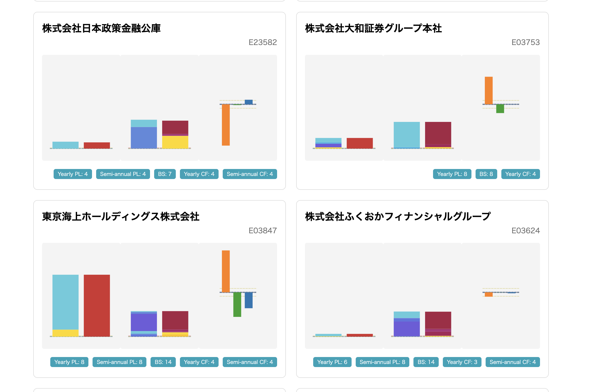

# 概要

arelle の使い方を示しつつ、XBRL からきちんとリンクファイルを使って階層構造をとってきて、それに対応するインスタンスを取得する方法を示す。
どちらかといえば、経済学徒ではなく、エンジニア寄りのバックグラウンドを持つ人向けに書いている。

# 背景
最近、財務諸表の勉強をしていて、いろんな企業の財務諸表を一括で見たいと思った。
読んでいた解説が、財務諸表を視覚化して説明するタイプのものだったので、会計データをとってきて、それを D3.js で描画することを考えた。

結果、作成した財務諸表可視化アプリの方はある程度できていて、以下のリンクから閲覧できる。


- https://financial-statements-visualization.sasakiy84.net/
- [sasakiy84/xbrl-extractor](https://github.com/sasakiy84/xbrl-extractor) (XBRL 抽出コード)

ただし、まだ少し大きめのバグが残っていたり、きちんとデータを確認できていなかったりする。
具体的には、マイナスになっている勘定科目に対応していない箇所があり、グラフの形が崩れているものや、うまくデータをとってこれずに変なものが描画されていたりする。
なので、現時点では、ふむふむ、こんな感じかーという程度で眺めるもの。

同じように財務諸表を可視化しているサービスとして、[バフェット・コード](https://www.buffett-code.com/)や、[財務諸表ハック](https://www.tukuttemiru.biz/)があるため、きちんと見たい場合はそちらを参照したほうがよい。

本当は可視化アプリを作ったことを自慢したかったのだが、上記のバグ（まあ原因はわかっているので直すだけではあるけど）や、欲しい機能の追加などができていない。
そして、しばらくの間は新しい機能の開発などが難しそうなので、XBRL の処理についてだけ先にまとめておくことにした。


企業一覧のページ


企業詳細の PL の部分。


企業詳細の BS の部分。


企業詳細の CF の部分。


こだわりポイントとして、各企業のグラフを同じ高さの基準を設定して見れるというものがある。
企業の財務規模の相場感をつかみたいというのが、これを作った理由の一つなので、結構満足できる機能になった。




# 実装
Python については前提知識とする。今回は、Python 3.13 を使っていて、可能な限り Type Hint を使っている。
また、EDINET から API を利用して XBRL をダウンロードする方法は、公式のドキュメント（これも PDF だけど）が丁寧なので解説しない。

最初におおまかな流れをまとめておく。
最終的には、各財務諸表の木構造と、ノードに対応する値を持った`BSInstance` などのクラスのインスタンスを取得することが目標となる。


まず、XBRL を ZIP のまま読み込んで、`ModelXbrl` オブジェクトを取得する。
次に、用意しておいた財務諸表のロールURL（`http://disclosure.edinet-fsa.go.jp/role/jppfs/rol_BalanceSheet` など）を使って、財務諸表ごとのルートコンセプトを取得する。
ルートコンセプトから計算リンクを辿って、その企業における財務諸表の木構造を抽出し、`BSConcept` といったクラスのインスタンスを作成する。
このとき、`BSConcept` などは、具体的な金額の値を持っていない。その企業がどのように財務諸表を構成しているかの情報を持っているだけ。
また、`BSConcept` は、`FinancialStatementConcept` というクラスを継承している。このクラスは、`arelle` のオブジェクトから構成される財務諸表一般に対しての操作を提供する。
最後に、各コンセプトに実装された `extract_instances` メソッドを呼び出して、その企業の当期分や前期分の財務諸表のインスタンスを取得する。

最終的には、おおよその企業について、以下のようなデータを取得することができるようになる。

まず、concept については、以下のような感じ。
これは、三菱ケミカルグループ株式会社の PL。

```
当期純利益又は当期純損失（△） / Profit (loss) / 当期純利益又は当期純損失（△）（平成26年3月28日財規等改正後） / credit
    税引前当期純利益又は税引前当期純損失（△） / Profit (loss) before income taxes / 税引前当期純利益又は税引前当期純損失（△） / credit / weight = 1.0 / order = 1.0
        経常利益又は経常損失（△） / Ordinary profit (loss) / 経常利益又は経常損失（△） / credit / weight = 1.0 / order = 1.0
            営業利益又は営業損失（△） / Operating profit (loss) / 営業利益又は営業損失（△） / credit / weight = 1.0 / order = 1.0
                営業収益 / Operating revenue / 営業収益 / credit / weight = 1.0 / order = 1.0
                    関係会社受取配当金 / Dividends from subsidiaries and associates / 関係会社受取配当金、営業活動による収益 / credit / weight = 1.0 / order = 1.0
                    運営費用収入 / OperationsCostsReceiptsRev / 運営費用収入、営業収益 / credit / weight = 1.0 / order = 2.0
                一般管理費 / General and administrative expenses / 一般管理費、販売費及び一般管理費 / debit / weight = -1.0 / order = 2.
```

そして、値をつけると以下のような感じ。
これは、トヨタの貸借対照表。

```json
{
  "assets": {
    "nameJa": "資産",
    "nameEn": "Assets",
    "value": 20991040000000.0,
    "items": [
      {
        "nameJa": "流動資産",
        "nameEn": "Current assets",
        "value": 8340434000000.0,
        "items": [
          //  省略
        ],
        "qname": "jppfs_cor:CurrentAssets",
        "weight_in_parent": 1.0,
        "order_in_parent": 1.0,
        "balance": "debit"
      },
      {
        "nameJa": "固定資産",
        "nameEn": "Non-current assets",
        "value": 12650607000000.0,
        "items": [
          {
            "nameJa": "有形固定資産",
            "nameEn": "Property, plant and equipment",
            "value": 1447816000000.0,
            "items": [
              {
                "nameJa": "建物（純額）",
                "nameEn": "Buildings, net",
                "value": 388600000000.0,
                "items": [],
                "qname": "jppfs_cor:BuildingsNet",
                "weight_in_parent": 1.0,
                "order_in_parent": 1.0,
                "balance": "debit"
              },
              // 省略
              {
                "nameJa": "建設仮勘定",
                "nameEn": "Construction in progress",
                "value": 129040000000.0,
                "items": [],
                "qname": "jppfs_cor:ConstructionInProgress",
                "weight_in_parent": 1.0,
                "order_in_parent": 7.0,
                "balance": "debit"
              }
            ],
            "qname": "jppfs_cor:PropertyPlantAndEquipment",
            "weight_in_parent": 1.0,
            "order_in_parent": 1.0,
            "balance": "debit"
          },
          {
            "nameJa": "投資その他の資産",
            "nameEn": "Investments and other assets",
            "value": 11202790000000.0,
            "items": [
              {
                "nameJa": "投資有価証券",
                "nameEn": "Investment securities",
                "value": 7441721000000.0,
                "items": [],
                "qname": "jppfs_cor:InvestmentSecurities",
                "weight_in_parent": 1.0,
                "order_in_parent": 1.0,
                "balance": "debit"
              },
              // 省略
              {
                "nameJa": "貸倒引当金",
                "nameEn": "Allowance for doubtful accounts",
                "value": -44900000000.0,
                "items": [],
                "qname": "jppfs_cor:AllowanceForDoubtfulAccountsIOAByGroup",
                "weight_in_parent": 1.0,
                "order_in_parent": 6.0,
                "balance": "debit"
              }
            ],
            "qname": "jppfs_cor:InvestmentsAndOtherAssets",
            "weight_in_parent": 1.0,
            "order_in_parent": 2.0,
            "balance": "debit"
          }
        ],
        "qname": "jppfs_cor:NoncurrentAssets",
        "weight_in_parent": 1.0,
        "order_in_parent": 2.0,
        "balance": "debit"
      }
    ],
    "qname": "jppfs_cor:Assets",
    "weight_in_parent": null,
    "order_in_parent": null,
    "balance": "debit"
  },
  "liabilities": {
    "nameJa": "負債",
    "nameEn": "Liabilities",
    "value": 6383768000000.0,
    "items": [
      {
        "nameJa": "流動負債",
        "nameEn": "Current liabilities",
        "value": 4798256000000.0,
        "items": [
          {
            "nameJa": "支払手形",
            "nameEn": "Notes payable - trade",
            "value": 8000000.0,
            "items": [],
            "qname": "jppfs_cor:NotesPayableTrade",
            "weight_in_parent": 1.0,
            "order_in_parent": 1.0,
            "balance": "credit"
          },
          // 省略
          {
            "nameJa": "その他",
            "nameEn": "Other",
            "value": 77392000000.0,
            "items": [],
            "qname": "jppfs_cor:OtherCL",
            "weight_in_parent": 1.0,
            "order_in_parent": 13.0,
            "balance": "credit"
          }
        ],
        "qname": "jppfs_cor:CurrentLiabilities",
        "weight_in_parent": 1.0,
        "order_in_parent": 1.0,
        "balance": "credit"
      },
      {
        "nameJa": "固定負債",
        "nameEn": "Non-current liabilities",
        "value": 1585512000000.0,
        "items": [
          {
            "nameJa": "社債",
            "nameEn": "Bonds payable",
            "value": 1011950000000.0,
            "items": [],
            "qname": "jppfs_cor:BondsPayable",
            "weight_in_parent": 1.0,
            "order_in_parent": 1.0,
            "balance": "credit"
          },
          {
            "nameJa": "退職給付引当金",
            "nameEn": "Provision for retirement benefits",
            "value": 362871000000.0,
            "items": [],
            "qname": "jppfs_cor:ProvisionForRetirementBenefits",
            "weight_in_parent": 1.0,
            "order_in_parent": 2.0,
            "balance": "credit"
          },
          {
            "nameJa": "その他",
            "nameEn": "Other",
            "value": 210691000000.0,
            "items": [],
            "qname": "jppfs_cor:OtherNCL",
            "weight_in_parent": 1.0,
            "order_in_parent": 3.0,
            "balance": "credit"
          }
        ],
        "qname": "jppfs_cor:NoncurrentLiabilities",
        "weight_in_parent": 1.0,
        "order_in_parent": 2.0,
        "balance": "credit"
      }
    ],
    "qname": "jppfs_cor:Liabilities",
    "weight_in_parent": 1.0,
    "order_in_parent": 1.0,
    "balance": "credit"
  },
  "net_assets": {
    "nameJa": "純資産",
    "nameEn": "Net assets",
    "value": 14607272000000.0,
    "items": [
      {
        "nameJa": "株主資本",
        "nameEn": "Shareholders' equity",
        "value": 13046366000000.0,
        "items": [
          {
            "nameJa": "資本金",
            "nameEn": "Share capital",
            "value": 635402000000.0,
            "items": [],
            "qname": "jppfs_cor:CapitalStock",
            "weight_in_parent": 1.0,
            "order_in_parent": 1.0,
            "balance": "credit"
          },
          // 省略
          {
            "nameJa": "自己株式",
            "nameEn": "Treasury shares",
            "value": -3311202000000.0,
            "items": [],
            "qname": "jppfs_cor:TreasuryStock",
            "weight_in_parent": 1.0,
            "order_in_parent": 4.0,
            "balance": "credit"
          }
        ],
        "qname": "jppfs_cor:ShareholdersEquity",
        "weight_in_parent": 1.0,
        "order_in_parent": 1.0,
        "balance": "credit"
      },
      {
        "nameJa": "評価・換算差額等",
        "nameEn": "Valuation and translation adjustments",
        "value": 1560906000000.0,
        "items": [
          {
            "nameJa": "その他有価証券評価差額金",
            "nameEn": "Valuation difference on available-for-sale securities",
            "value": 1560906000000.0,
            "items": [],
            "qname": "jppfs_cor:ValuationDifferenceOnAvailableForSaleSecurities",
            "weight_in_parent": 1.0,
            "order_in_parent": 1.0,
            "balance": "credit"
          }
        ],
        "qname": "jppfs_cor:ValuationAndTranslationAdjustments",
        "weight_in_parent": 1.0,
        "order_in_parent": 2.0,
        "balance": "credit"
      }
    ],
    "qname": "jppfs_cor:NetAssets",
    "weight_in_parent": 1.0,
    "order_in_parent": 2.0,
    "balance": "credit"
  }
}
```

## arelle のインストール

arelle というパッケージ名のものがあるが、[arelle-release](https://pypi.org/project/arelle-release/) の方をインストールする。


```bash
pip install arelle-release
```

## XBRL を読み込む

以下のような関数を作成した。
一応リスト形式で `ModelXbrl` を返しているが、おそらく一つしかモデルはないと思うので、お好みでシグネチャを変更してもよさそう。

```python
from pathlib import Path
from zipfile import ZipFile
from arelle.ModelXbrl import ModelXbrl
from arelle import Cntlr, FileSource

def load_xbrls_with_arelle(xbrl_file_path: Path) -> tuple[list[ModelXbrl], Cntlr.Cntlr]:
    cntlr = Cntlr.Cntlr(logFileName="logToPrint")
    cntlr.startLogging()
    target_file = FileSource.openFileSource(str(xbrl_file_path))
    cntlr.modelManager.load(target_file)

    loaded_model_xbrls: list[ModelXbrl] = cntlr.modelManager.loadedModelXbrls
    return loaded_model_xbrls, cntlr


def load_edinet_xbrl_models_from_zip(
    zip_file_path: Path,
) -> tuple[list[ModelXbrl], Cntlr.Cntlr]:
    """
    EDINET の XBRL の ZIP ファイルを読み込む。
    model のリストと、Cntlr オブジェクトを返す。
    Cntlr オブジェクトは、arelle のコントローラーで、主に close するために使う。
    """
    archived_files = ZipFile(zip_file_path).namelist()
    entry_points_canditates = []
    for archived_file_path in archived_files:
        archived_file_path = Path(archived_file_path)
        if archived_file_path.match("XBRL/PublicDoc/*.xbrl"):
            entry_points_canditates.append(archived_file_path)

    # 多分一つしかないはず
    if len(entry_points_canditates) == 0:
        raise ValueError(f"No XBRL files found in the archive: {zip_file_path}")
    elif len(entry_points_canditates) > 1:
        raise ValueError(f"Multiple XBRL files found in the archive: {zip_file_path}")

    entry_point = entry_points_canditates[0]
    # arelle は ZIP を解凍しなくても読み込める
    target_file_with_entry_point = zip_file_path / entry_point

    xbrl, cntlr = load_xbrl_with_arelle(target_file_with_entry_point)
    return xbrl, cntlr
```

## ルート要素を列挙する

金融庁が[EDINETタクソノミ及びコードリストダウンロード](https://disclosure2.edinet-fsa.go.jp/weee0010.aspx)で公開しているタクソノミから、「2025年版EDINETタクソノミ（2025年3月31日以後に終了する事業年度に係る有価証券報告書等から適用）」をダウンロードして、財務諸表のロールURLを手動でリスト化した。
これらの要素から計算リンクを辿って、個々の値を含んだ木構造を取得することができる。

ルート要素の一覧は以下のようになる。なお、どの要素がどれくらい使われているかはわからない。
```python
BS_ROLE_TYPE_JP = [
    "http://disclosure.edinet-fsa.go.jp/role/jppfs/rol_BalanceSheet",  # 310040 貸借対照表
    "http://disclosure.edinet-fsa.go.jp/role/jppfs/rol_std_BalanceSheet",  # 310040 貸借対照表
    "http://disclosure.edinet-fsa.go.jp/role/jppfs/rol_SemiAnnualBalanceSheet",  # 310050 第二種中間貸借対照表
    "http://disclosure.edinet-fsa.go.jp/role/jppfs/rol_std_SemiAnnualBalanceSheet",  # 310050 第二種中間貸借対照表
    "http://disclosure.edinet-fsa.go.jp/role/jppfs/rol_Type1SemiAnnualBalanceSheet",  # 310051 第一種中間貸借対照表
    "http://disclosure.edinet-fsa.go.jp/role/jppfs/rol_std_Type1SemiAnnualBalanceSheet",  # 310051 第一種中間貸借対照表
    "http://disclosure.edinet-fsa.go.jp/role/jppfs/rol_QuarterlyBalanceSheet",  # 310060 四半期貸借対照表（2025年版で廃止）
    "http://disclosure.edinet-fsa.go.jp/role/jppfs/rol_std_QuarterlyBalanceSheet",  # 310060 四半期貸借対照表（2025年版で廃止）
]
CONSOLIDATED_BS_ROLE_TYPE_JP = [
    "http://disclosure.edinet-fsa.go.jp/role/jppfs/rol_ConsolidatedBalanceSheet",  # 310010 連結貸借対照表
    "http://disclosure.edinet-fsa.go.jp/role/jppfs/rol_std_ConsolidatedBalanceSheet",  # 310010 連結貸借対照表
    "http://disclosure.edinet-fsa.go.jp/role/jppfs/rol_SemiAnnualConsolidatedBalanceSheet",  # 310020 第二種中間連結貸借対照表
    "http://disclosure.edinet-fsa.go.jp/role/jppfs/rol_std_SemiAnnualConsolidatedBalanceSheet",  # 310020 第二種中間連結貸借対照表
    "http://disclosure.edinet-fsa.go.jp/role/jppfs/rol_std_Type1SemiAnnualConsolidatedBalanceSheet",  # 310021 第一種中間連結貸借対照
    "http://disclosure.edinet-fsa.go.jp/role/jppfs/rol_QuarterlyConsolidatedBalanceSheet",  # 310030 四半期連結貸借対照表（2025年版で廃止）
    "http://disclosure.edinet-fsa.go.jp/role/jppfs/rol_std_QuarterlyConsolidatedBalanceSheet",  # 310030 四半期連結貸借対照表（2025年版で廃止）
]
PL_ROLE_TYPE_JP = [
    "http://disclosure.edinet-fsa.go.jp/role/jppfs/rol_StatementOfIncome",  # 321040 損益計算書
    "http://disclosure.edinet-fsa.go.jp/role/jppfs/rol_std_StatementOfIncome",  # 321040 損益計算書
    "http://disclosure.edinet-fsa.go.jp/role/jppfs/rol_SemiAnnualStatementOfIncome",  # 321050 第二種中間損益計算書
    "http://disclosure.edinet-fsa.go.jp/role/jppfs/rol_std_SemiAnnualStatementOfIncome",  # 321050 第二種中間損益計算書
    "http://disclosure.edinet-fsa.go.jp/role/jppfs/rol_Type1SemiAnnualStatementOfIncome",  # 321051 第一種中間損益計算書
    "http://disclosure.edinet-fsa.go.jp/role/jppfs/rol_std_Type1SemiAnnualStatementOfIncome",  # 321051 第一種中間損益計算書
    "http://disclosure.edinet-fsa.go.jp/role/jppfs/rol_std_YearToQuarterEndStatementOfIncome",  # 321061 四半期損益計算書　四半期累計期間（2025年版で廃止）
    "http://disclosure.edinet-fsa.go.jp/role/jppfs/rol_YearToQuarterEndStatementOfIncome",  # 321061 四半期損益計算書　四半期累計期間（2025年版で廃止）
]
CONSOLIDATED_PL_ROLE_TYPE_JP = [
    "http://disclosure.edinet-fsa.go.jp/role/jppfs/rol_ConsolidatedStatementOfIncome",  # 321010 連結損益（及び包括利益）計算書
    "http://disclosure.edinet-fsa.go.jp/role/jppfs/rol_std_ConsolidatedStatementOfIncome",  # 321010 連結損益（及び包括利益）計算書
    "http://disclosure.edinet-fsa.go.jp/role/jppfs/rol_SemiAnnualConsolidatedStatementOfIncome",  # 321020 第二種中間連結損益（及び包括利益）計算書
    "http://disclosure.edinet-fsa.go.jp/role/jppfs/rol_std_SemiAnnualConsolidatedStatementOfIncome",  # 321020 第二種中間連結損益（及び包括利益）計算書
    "http://disclosure.edinet-fsa.go.jp/role/jppfs/rol_Type1SemiAnnualConsolidatedStatementOfIncome",  # 321021 第一種中間連結損益（及び包括利益）計算書
    "http://disclosure.edinet-fsa.go.jp/role/jppfs/rol_std_Type1SemiAnnualConsolidatedStatementOfIncome",  # 321021 第一種中間連結損益（及び包括利益）計算書
    "http://disclosure.edinet-fsa.go.jp/role/jppfs/rol_std_YearToQuarterEndConsolidatedStatementOfIncome",  # 321031 四半期連結損益（及び包括利益）計算書　四半期連結累計期間（2025年版で廃止）
    "http://disclosure.edinet-fsa.go.jp/role/jppfs/rol_YearToQuarterEndConsolidatedStatementOfIncome",  # 321032 四半期連結損益（及び包括利益）計算書　四半期連結会計期間（2025年版で廃止）\
    "http://disclosure.edinet-fsa.go.jp/role/jppfs/rol_std_QuarterPeriodConsolidatedStatementOfIncome",  # 321032 四半期連結損益（及び包括利益）計算書　四半期連結会計期間（2025年版で廃止）
]
CF_ROLE_TYPE_JP = [
    "http://disclosure.edinet-fsa.go.jp/role/jppfs/rol_StatementOfCashFlows-direct",  # 341040 キャッシュ・フロー計算書　直接法
    "http://disclosure.edinet-fsa.go.jp/role/jppfs/rol_std_StatementOfCashFlows-direct",  # 341040 キャッシュ・フロー計算書　直接法
    "http://disclosure.edinet-fsa.go.jp/role/jppfs/rol_SemiAnnualStatementOfCashFlows-direct",  # 341050 第二種中間キャッシュ・フロー計算書　直接法
    "http://disclosure.edinet-fsa.go.jp/role/jppfs/rol_std_SemiAnnualStatementOfCashFlows-direct",  # 341050 第二種中間キャッシュ・フロー計算書　直接法
    "http://disclosure.edinet-fsa.go.jp/role/jppfs/rol_Type1SemiAnnualStatementOfCashFlows-direct",  # 341051 第一種中間キャッシュ・フロー計算書　直接法
    "http://disclosure.edinet-fsa.go.jp/role/jppfs/rol_std_Type1SemiAnnualStatementOfCashFlows-direct",  # 341051 第一種中間キャッシュ・フロー計算書　直接法
    "http://disclosure.edinet-fsa.go.jp/role/jppfs/rol_QuarterlyStatementOfCashFlows-direct",  # 341060 四半期キャッシュ・フロー計算書　直接法（2025年版で廃止）
    "http://disclosure.edinet-fsa.go.jp/role/jppfs/rol_std_QuarterlyStatementOfCashFlows-direct",  # 341060 四半期キャッシュ・フロー計算書　直接法（2025年版で廃止）
    "http://disclosure.edinet-fsa.go.jp/role/jppfs/rol_StatementOfCashFlows-indirect",  # 342040 キャッシュ・フロー計算書　間接法
    "http://disclosure.edinet-fsa.go.jp/role/jppfs/rol_std_StatementOfCashFlows-indirect",  # 342040 キャッシュ・フロー計算書　間接法
    "http://disclosure.edinet-fsa.go.jp/role/jppfs/rol_SemiAnnualStatementOfCashFlows-indirect",  # 342050 第二種中間キャッシュ・フロー計算書　間接法
    "http://disclosure.edinet-fsa.go.jp/role/jppfs/rol_std_SemiAnnualStatementOfCashFlows-indirect",  # 342050 第二種中間キャッシュ・フロー計算書　間接法
    "http://disclosure.edinet-fsa.go.jp/role/jppfs/rol_Type1SemiAnnualStatementOfCashFlows-indirect",  # 342051 第一種中間キャッシュ・フロー計算書　間接法
    "http://disclosure.edinet-fsa.go.jp/role/jppfs/rol_std_Type1SemiAnnualStatementOfCashFlows-indirect",  # 342051 第一種中間キャッシュ・フロー計算書　間接法
    "http://disclosure.edinet-fsa.go.jp/role/jppfs/rol_QuarterlyStatementOfCashFlows-indirect",  # 342060 四半期キャッシュ・フロー計算書　間接法（2025年版で廃止）
    "http://disclosure.edinet-fsa.go.jp/role/jppfs/rol_std_QuarterlyStatementOfCashFlows-indirect",  # 342060 四半期キャッシュ・フロー計算書　間接法（2025年版で廃止）
]
CONSOLIDATED_CF_ROLE_TYPE_JP = [
    "http://disclosure.edinet-fsa.go.jp/role/jppfs/rol_ConsolidatedStatementOfCashFlows-direct",  # 341010 連結キャッシュ・フロー計算書　直接法
    "http://disclosure.edinet-fsa.go.jp/role/jppfs/rol_std_ConsolidatedStatementOfCashFlows-direct",  # 341010 連結キャッシュ・フロー計算書　直接法
    "http://disclosure.edinet-fsa.go.jp/role/jppfs/rol_SemiAnnualConsolidatedStatementOfCashFlows-direct",  # 341020 第二種中間連結キャッシュ・フロー計算書　直接法
    "http://disclosure.edinet-fsa.go.jp/role/jppfs/rol_std_SemiAnnualConsolidatedStatementOfCashFlows-direct",  # 341020 第二種中間連結キャッシュ・フロー計算書　直接法
    "http://disclosure.edinet-fsa.go.jp/role/jppfs/rol_Type1SemiAnnualConsolidatedStatementOfCashFlows-direct",  # 341021 第一種中間連結キャッシュ・フロー計算書　直接法
    "http://disclosure.edinet-fsa.go.jp/role/jppfs/rol_std_Type1SemiAnnualConsolidatedStatementOfCashFlows-direct",  # 341021 第一種中間連結キャッシュ・フロー計算書　直接法
    "http://disclosure.edinet-fsa.go.jp/role/jppfs/rol_QuarterlyConsolidatedStatementOfCashFlows-direct",  # 341030 四半期連結キャッシュ・フロー計算書　直接法（2025年版で廃止）
    "http://disclosure.edinet-fsa.go.jp/role/jppfs/rol_std_QuarterlyConsolidatedStatementOfCashFlows-direct",  # 341030 四半期連結キャッシュ・フロー計算書　直接法（2025年版で廃止）
    "http://disclosure.edinet-fsa.go.jp/role/jppfs/rol_ConsolidatedStatementOfCashFlows-indirect",  # 342010 連結キャッシュ・フロー計算書　間接法
    "http://disclosure.edinet-fsa.go.jp/role/jppfs/rol_std_ConsolidatedStatementOfCashFlows-indirect",  # 342010 連結キャッシュ・フロー計算書　間接法
    "http://disclosure.edinet-fsa.go.jp/role/jppfs/rol_SemiAnnualConsolidatedStatementOfCashFlows-indirect",  # 342020 第二種中間連結キャッシュ・フロー計算書　間接法
    "http://disclosure.edinet-fsa.go.jp/role/jppfs/rol_std_SemiAnnualConsolidatedStatementOfCashFlows-indirect",  # 342020 第二種中間連結キャッシュ・フロー計算書　間接法
    "http://disclosure.edinet-fsa.go.jp/role/jppfs/rol_Type1SemiAnnualConsolidatedStatementOfCashFlows-indirect",  # 342021 第一種中間連結キャッシュ・フロー計算書　間接法
    "http://disclosure.edinet-fsa.go.jp/role/jppfs/rol_std_Type1SemiAnnualConsolidatedStatementOfCashFlows-indirect",  # 342021 第一種中間連結キャッシュ・フロー計算書　間接法
    "http://disclosure.edinet-fsa.go.jp/role/jppfs/rol_QuarterlyConsolidatedStatementOfCashFlows-indirect",  # 342030 四半期連結キャッシュ・フロー計算書　間接法（2025年版で廃止）
    "http://disclosure.edinet-fsa.go.jp/role/jppfs/rol_std_QuarterlyConsolidatedStatementOfCashFlows-indirect",  # 342030 四半期連結キャッシュ・フロー計算書　間接法（2025年版で廃止）
]

BS_ROLE_TYPE_IFRS = [
    "http://disclosure.edinet-fsa.go.jp/role/jpigp/rol_StatementOfFinancialPositionIFRS",  # 513040 財政状態計算書（IFRS）
    "http://disclosure.edinet-fsa.go.jp/role/jpigp/rol_CondensedSemiAnnualStatementOfFinancialPositionIFRS",  # 513050 要約中間財政状態計算書（IFRS）
    "http://disclosure.edinet-fsa.go.jp/role/jpigp/rol_CondensedQuarterlyStatementOfFinancialPositionIFRS",  # 513060 要約四半期財政状態計算書（IFRS）（2025年版で廃止）
]
CONSOLIDATED_BS_ROLE_TYPE_IFRS = [
    "http://disclosure.edinet-fsa.go.jp/role/jpigp/rol_ConsolidatedStatementOfFinancialPositionIFRS",  # 513010 連結財政状態計算書（IFRS）
    "http://disclosure.edinet-fsa.go.jp/role/jpigp/rol_std_ConsolidatedStatementOfFinancialPositionIFRS",  # 513010 連結財政状態計算書（IFRS）
    "http://disclosure.edinet-fsa.go.jp/role/jpigp/rol_CondensedSemiAnnualConsolidatedStatementOfFinancialPositionIFRS",  # 513020 要約中間連結財政状態計算書（IFRS）
    "http://disclosure.edinet-fsa.go.jp/role/jpigp/rol_CondensedQuarterlyConsolidatedStatementOfFinancialPositionIFRS",  # 513030 要約四半期連結財政状態計算書（IFRS）（2025年版で廃止）
]

PL_ROLE_TYPE_IFRS = [
    "http://disclosure.edinet-fsa.go.jp/role/jpigp/rol_StatementOfProfitOrLossIFRS",  # 521040 損益計算書（IFRS）
    "http://disclosure.edinet-fsa.go.jp/role/jpigp/rol_CondensedSemiAnnualStatementOfProfitOrLossIFRS",  # 521050 要約中間損益計算書（IFRS）
    "http://disclosure.edinet-fsa.go.jp/role/jpigp/rol_CondensedYearToQuarterEndStatementOfProfitOrLossIFRS",  # 521061 要約四半期損益計算書（IFRS）四半期累計期間（2025年版で廃止）
    "http://disclosure.edinet-fsa.go.jp/role/jpigp/rol_CondensedQuarterPeriodStatementOfProfitOrLossIFRS",  # 521062 要約四半期損益計算書（IFRS）四半期会計期間（2025年版で廃止）
]
CONSOLIDATED_PL_ROLE_TYPE_IFRS = [
    "http://disclosure.edinet-fsa.go.jp/role/jpigp/rol_ConsolidatedStatementOfProfitOrLossIFRS",  # 521010 連結損益計算書（IFRS）
    "http://disclosure.edinet-fsa.go.jp/role/jpigp/rol_CondensedSemiAnnualConsolidatedStatementOfProfitOrLossIFRS",  # 521020 要約中間連結損益計算書（IFRS）
    "http://disclosure.edinet-fsa.go.jp/role/jpigp/rol_CondensedYearToQuarterEndConsolidatedStatementOfProfitOrLossIFRS",  # 521031 要約四半期連結損益計算書（IFRS）四半期累計期間（2025年版で廃止）
    "http://disclosure.edinet-fsa.go.jp/role/jpigp/rol_CondensedQuarterPeriodConsolidatedStatementOfProfitOrLossIFRS",  # 521032 要約四半期連結損益計算書（IFRS）四半期会計期間（2025年版で廃止）
]
CF_ROLE_TYPE_IFRS = [
    "http://disclosure.edinet-fsa.go.jp/role/jpigp/rol_StatementOfCashFlowsIFRS",  # 540040 キャッシュ・フロー計算書（IFRS）
    "http://disclosure.edinet-fsa.go.jp/role/jpigp/rol_CondensedSemiAnnualStatementOfCashFlowsIFRS",  # 540050 要約中間キャッシュ・フロー計算書（IFRS）
    "http://disclosure.edinet-fsa.go.jp/role/jpigp/rol_CondensedQuarterlyStatementOfCashFlowsIFRS",  # 540060 要約四半期キャッシュ・フロー計算書（IFRS）（2025年版で廃止）
]
CONSOLIDATED_CF_ROLE_TYPE_IFRS = [
    "http://disclosure.edinet-fsa.go.jp/role/jpigp/rol_ConsolidatedStatementOfCashFlowsIFRS",  # 540010 連結キャッシュ・フロー計算書（IFRS）
    "http://disclosure.edinet-fsa.go.jp/role/jpigp/rol_std_ConsolidatedStatementOfCashFlowsIFRS",  # 540010 連結キャッシュ・フロー計算書（IFRS）
    "http://disclosure.edinet-fsa.go.jp/role/jpigp/rol_CondensedSemiAnnualConsolidatedStatementOfCashFlowsIFRS",  # 540020 要約中間連結キャッシュ・フロー計算書（IFRS）
    "http://disclosure.edinet-fsa.go.jp/role/jpigp/rol_CondensedQuarterlyConsolidatedStatementOfCashFlowsIFRS",  # 540030 要約四半期連結キャッシュ・フロー計算書（IFRS）（2025年版で廃止）
]
```

## コンテキストIDを列挙する
```

STANDARD_CONTEXT_ID_FIRST_ITEM = [
    "CurrentYear",
    "Interim",
    "Prior1Year",
    "Prior1Interim",
    "Prior2Year",
    "Prior2Interim",
    "Prior3Year",
    "Prior3Interim",
    "Prior4Year",
    "Prior4Interim",
    "Prior5Year",
    "Prior5Interim",
    "Prior6Year",
    "Prior6Interim",
    "Prior7Year",
    "Prior7Interim",
    "Prior8Year",
    "Prior8Interim",
]

STANDARD_CONTEXT_ID_SECOND_ITEM = [
    "Instant",
    "Duration",
]

STANDARD_CONTEXT_ID_THIRD_ITEM = [
    "",
    "_NonConsolidatedMember",
]

# [報告書インスタンス作成ガイドライン](https://www.fsa.go.jp/search/20241112/2b-1_InstanceGuide.pdf#41)
# 5-4-1 コンテキスト ID の命名規約 を参照
# Prior1YearInstant_jpcrp030000-asr_E00034-000RealEstateReportableSegmentsMember などと区別するためのリスト
STANDARD_CONTEXT_ID = [
    f"{first_item}{second_item}{third_item}"
    for first_item, second_item, third_item in product(
        STANDARD_CONTEXT_ID_FIRST_ITEM,
        STANDARD_CONTEXT_ID_SECOND_ITEM,
        STANDARD_CONTEXT_ID_THIRD_ITEM,
    )
]
```

## 財務諸表の基底クラスを作る

いろいろと書いているが、`FinancialStatementConcept` を継承して、各財務諸表のクラスを作る。
そのときに、統一的に利用できるメソッドを `FinancialStatementConcept` に書いておいている。
これを継承したクラスでは、`abstractmethod` のアノテーションがついている `extract_instances` というメソッドを実装し、財務諸表のインスタンスを取得できるようにしなければならない。

```python
from abc import abstractmethod
from datetime import datetime
from itertools import combinations

from typing import Literal, Optional, Self, TypeVar
from arelle.ModelXbrl import ModelXbrl, ModelFact, ModelContext
from arelle.ModelDtsObject import ModelConcept, ModelRelationship
from arelle import XbrlConst
from pydantic import BaseModel


def _to_str_recursively(
    concept: ModelConcept,
    link_role: str,
    summation_item: str,
    depth: int = 0,
    suffix=None,
) -> str:
    parent_result = f"{'    ' * depth}{concept.label(lang='ja')} / {concept.label(lang='en')} / {concept.label(preferredLabel=XbrlConst.verboseLabel)} / {concept.qname} / {concept.balance}"
    if suffix:
        parent_result += f" / {suffix}"
    for relation in concept.modelXbrl.relationshipSet(
        summation_item, linkrole=link_role
    ).fromModelObject(concept):
        children_result = _to_str_recursively(
            relation.toModelObject,
            link_role=link_role,
            summation_item=summation_item,
            depth=depth + 1,
            suffix=f"weight = {relation.weight} / order = {relation.order}",
        )
        parent_result += f"\n{children_result}"
    return parent_result


def is_consolidated_fact(fact: ModelFact) -> bool:
    """
    EDINET は contextId に _NonConsolidatedMember が含まれている場合に非連結財務諸表として扱う
    [報告書インスタンス作成ガイドライン](https://www.fsa.go.jp/search/20241112/2b-1_InstanceGuide.pdf#41)
    """
    id = fact.contextID
    return "_NonConsolidatedMember" not in id


def is_standard_context(context: ModelContext) -> bool:
    return context.id in STANDARD_CONTEXT_ID


def get_context_used_in_concept(
    concept: ModelConcept, consolidated: bool
) -> list[ModelContext]:
    model_xbrl = concept.modelXbrl
    facts = model_xbrl.factsByQname[concept.qname]
    contexts: set[ModelContext] = set()
    for fact in facts:
        if is_consolidated_fact(fact) != consolidated:
            continue
        if not is_standard_context(fact.context):
            continue
        contexts.add(fact.context)
    return list(contexts)


class AccountingItem(BaseModel):
    name: str
    nameJa: Optional[str]
    nameEn: Optional[str]
    nameDetail: str
    nameDetailJa: Optional[str]
    nameDetailEn: Optional[str]
    value: float
    items: list[Self]
    qname: str
    weight_in_parent: float | None = None
    order_in_parent: float | None = None
    balance: Literal["debit", "credit"] | None = None


class FinancialStatementConcept:
    InstanceType = TypeVar("InstanceType")

    def __init__(
        self,
        root_concepts: list[ModelConcept],
        role_type: str,
        summation_item: str,
        account_standard: str,
        consolidated: bool,
        docId: str,
        docType: Literal["Annual", "SemiAnnual", "Quarterly"],
        docSubmissionDate: datetime,
    ) -> Self:
        self.root_concepts = root_concepts
        self.role_type = role_type
        self.summation_item = summation_item
        self.account_standard = account_standard
        self.consolidated = consolidated
        self.docId = docId
        self.docType = docType
        self.docSubmissionDate = docSubmissionDate
        self.contexts: list[ModelContext] = []

        if len(root_concepts) == 0:
            raise ValueError("Root concept should have at least 1 concept.")

        if root_concepts[0].modelXbrl is not None:
            self.xbrl_model: ModelXbrl = root_concepts[0].modelXbrl
        else:
            raise ValueError(
                f"ModelXbrl is not set in root_concepts[0]: {root_concepts[0]}"
            )

        contexts_used_in_each_root_concept: list[list[ModelContext]] = []
        for root_concept in root_concepts:
            contexts_used_in_root_concept = get_context_used_in_concept(
                root_concept, self.consolidated
            )
            contexts_used_in_each_root_concept.append(contexts_used_in_root_concept)

        # 株式会社ミツトヨの第105期半期決算では、BS の資産のルートコンセプトに紐づくコンテキストと負債純資産のルートコンセプトに紐づくコンテキストの集合が異なり、
        # 資産のほうにだけ、Prior1InterimInstant が入っている。PDF を見ても、実際にそうで、サマリーのところにPrior1InterimInstantの資産額だけ書いてある
        # これまでは、集合が完全に一致しないとエラーにしていたが、この事例によりコンテキストの集合の積をとることにした
        contexts_used_in_all_root_concepts = None
        for contexts_used_in_root_concept in contexts_used_in_each_root_concept:
            if contexts_used_in_all_root_concepts is None:
                contexts_used_in_all_root_concepts = set(contexts_used_in_root_concept)
            else:
                contexts_used_in_all_root_concepts = (
                    contexts_used_in_all_root_concepts
                    & set(contexts_used_in_root_concept)
                )

        if contexts_used_in_all_root_concepts is None:
            raise ValueError(
                f"Contexts used in all root concepts are not found, root_concepts: {root_concepts}"
            )

        self.contexts = list(contexts_used_in_all_root_concepts)

    @property
    def to_str_recursively(self) -> str:
        for root_concept in self.root_concepts:
            return _to_str_recursively(
                root_concept, self.role_type, self.summation_item
            )

    def _get_unique_fact_by_concept_and_context(
        self, concept: ModelConcept, context: ModelContext
    ) -> Optional[ModelFact]:
        facts = self.xbrl_model.factsByQname[concept.qname]
        facts: list[ModelFact] = list(
            filter(lambda fact: fact.context == context, facts)
        )
        if len(facts) == 1:
            return facts[0]
        elif len(facts) == 0:
            return None
        else:
            for fact_a, fact_b in combinations(facts, 2):
                if fact_a.sValue != fact_b.sValue:
                    raise ValueError(
                        f"Multiple facts with different values are found. facts: {facts}, context: {context}, concept: {concept}"
                    )
            return facts[0]

    def _get_to_child_relationship(
        self, parent_concept: ModelConcept
    ) -> list[ModelRelationship]:
        return self.xbrl_model.relationshipSet(
            self.summation_item, linkrole=self.role_type
        ).fromModelObject(parent_concept)

    def _get_child_concepts(
        self, parent_concept: ModelConcept
    ) -> list[tuple[ModelConcept, ModelRelationship]]:
        """
        Returns:
            list[tuple[ModelConcept, ModelRelationship]]: child_concepts と、親から子への関係のタプルのリスト
        """
        relationships = self._get_to_child_relationship(parent_concept)
        return [
            (relationship.toModelObject, relationship) for relationship in relationships
        ]

    def _extract_items(
        self,
        parent_concept: ModelConcept,
        context: ModelContext,
        relationship: ModelRelationship | None = None,
    ) -> AccountingItem | None:
        """
        context によって特定できる parent_concept 自身とその子孫の情報を再帰的に取得する
        """
        parent_fact = self._get_unique_fact_by_concept_and_context(
            parent_concept, context
        )
        if parent_fact is None:
            return None
        if parent_fact.isNil:
            return None
        nameJa = parent_fact.concept.label(lang="ja")
        nameEn = parent_fact.concept.label(lang="en")
        nameDetailJa = parent_fact.concept.label(
            preferredLabel=XbrlConst.verboseLabel, lang="ja"
        )
        nameDetailEn = parent_fact.concept.label(
            preferredLabel=XbrlConst.verboseLabel, lang="en"
        )

        item = AccountingItem(
            nameJa=nameJa,
            nameEn=nameEn,
            nameDetailJa=nameDetailJa,
            nameDetailEn=nameDetailEn,
            name=nameJa or nameEn or parent_fact.concept.label(),
            nameDetail=nameDetailJa
            or nameDetailEn
            or parent_fact.concept.label(preferredLabel=XbrlConst.verboseLabel),
            value=parent_fact.xValue,
            items=[],
            qname=str(parent_fact.concept.qname),
            balance=parent_fact.concept.balance,
            weight_in_parent=relationship.weight if relationship is not None else None,
            order_in_parent=relationship.order if relationship is not None else None,
        )

        child_concepts = self._get_child_concepts(parent_concept)
        for child_concept, relationship in child_concepts:
            child_item = self._extract_items(child_concept, context, relationship)
            if child_item is not None:
                item.items.append(child_item)

        return item

    @staticmethod
    def search_unique_concept_by_qname_or_none(
        concepts: list[ModelConcept], qname: list[str]
    ) -> ModelConcept | None:
        """
        一つしかないと想定している concept を、その qname で検索する
        """
        searched_concepts: set[ModelConcept] = set()
        for concept in concepts:
            if str(concept.qname) in qname:
                searched_concepts.add(concept)
        if len(searched_concepts) == 1:
            return searched_concepts.pop()
        elif len(searched_concepts) > 1:
            raise ValueError(
                f"Multiple concepts are found. qname: {qname}, searched_concepts: {searched_concepts}"
            )
        else:
            return None

    @staticmethod
    def search_unique_concept_by_local_name(
        concepts: list[ModelConcept], local_name: list[str]
    ) -> Optional[ModelConcept]:
        """
        一つしかないと想定している concept を、その local_name で検索する
        """
        searched_concepts: set[ModelConcept] = set()
        for concept in concepts:
            if concept.qname.localName in local_name:
                searched_concepts.add(concept)
        if len(searched_concepts) == 1:
            return searched_concepts.pop()
        elif len(searched_concepts) > 1:
            raise ValueError(
                f"Multiple concepts are found. local_name: {local_name}, searched_concepts: {searched_concepts}"
            )
        else:
            return None

    @staticmethod
    def search_unique_concept_by_label(
        concepts: list[ModelConcept], words_in_label: list[str]
    ) -> ModelConcept | None:
        """
        一つしかないと想定している concept を、そのラベルに含まれる単語で検索する
        """
        searched_concepts: set[ModelConcept] = set()
        for concept in concepts:
            for search_word in words_in_label:
                if search_word in concept.label(lang="ja"):
                    searched_concepts.add(concept)
                elif search_word in concept.label(lang="en"):
                    searched_concepts.add(concept)
        if len(searched_concepts) == 1:
            return searched_concepts.pop()
        elif len(searched_concepts) > 1:
            raise ValueError(
                f"Multiple concepts are found. words_in_label: {words_in_label}, searched_concepts: {searched_concepts}"
            )
        else:
            return None

    @abstractmethod
    def extract_instances(self) -> list[InstanceType]:
        pass
```

## 貸借対照表のクラスを作る
例として、貸借対照表のクラスを作る。
`BSConcept` は、各ルート要素に対応している。
たとえば、`http://disclosure.edinet-fsa.go.jp/role/jppfs/rol_BalanceSheet`など。
そして、それが現在の会社でどのような要素から構成されるかという木構造の情報を持っている。

`BSInstance` は、貸借対照表のインスタンスを表す。
たとえば、`2025年3月31日時点の貸借対照表`など。
`BSConcept` の `extract_instances` メソッドを呼び出すことで、`BSInstance` のリストを取得できる。
この `__init__` と `extract_instances` がミソで、例外的な構造をしている企業があると、ここの部分を変えて対応する必要がある。

一方で、ここのインターフェースを揃えて中身をきちんと実装できれば、`ModelXbrl` を受け取って、`BSConcept` を作成し、`extract_instances` を呼び出すというように、すべての XBRL を統一的に処理できるようになる。


```python
from datetime import datetime
from typing import Literal
from arelle.ModelDtsObject import ModelConcept
from pydantic import BaseModel


class BSInstance(BaseModel):
    accountStandard: str
    assets: AccountingItem
    liabilities: AccountingItem
    net_assets: AccountingItem
    consolidated: bool
    period: datetime
    unit: str
    roleType: str
    docId: str
    docType: Literal["Annual", "SemiAnnual", "Quarterly"]
    docSubmissionDate: datetime


class BSConcept(FinancialStatementConcept):
    def __init__(
        self,
        root_concepts: list[ModelConcept],
        role_type: str,
        summation_item: str,
        account_standard: str,
        consolidated: bool,
        doc_id: str,
        doc_type: Literal["Annual", "SemiAnnual", "Quarterly"],
        doc_submission_date: datetime,
    ):
        super().__init__(
            root_concepts,
            role_type,
            summation_item,
            account_standard,
            consolidated,
            doc_id,
            doc_type,
            doc_submission_date,
        )

        root_debit_concept: ModelConcept | None = None
        root_credit_concept: ModelConcept | None = None
        if len(root_concepts) != 2:
            raise ValueError(
                f"Root concept should have 2 concepts, root_concepts: {root_concepts}"
            )
        for root_concept in root_concepts:
            if root_concept.balance == "debit":
                root_debit_concept = root_concept
            elif root_concept.balance == "credit":
                root_credit_concept = root_concept

        if root_debit_concept is None and root_credit_concept is None:
            raise ValueError(
                f"Root concept should have debit or credit balance. root_concepts: {root_concepts}"
            )
        if root_debit_concept is None:
            raise ValueError(
                f"Root concept should have debit balance. root_concepts: {root_concepts}"
            )
        if root_credit_concept is None:
            raise ValueError(
                f"Root concept should have credit balance. root_concepts: {root_concepts}"
            )

        self.root_debit_concept = root_debit_concept
        self.root_credit_concept = root_credit_concept

    def extract_instances(self) -> list[BSInstance]:
        """
        contextRef ごとの貸借対照表のインスタンスを取得する
        """
        if len(self.root_concepts) == 0:
            return []
        instances: list[BSInstance] = []

        for context in self.contexts:
            assets = self._extract_items(self.root_debit_concept, context)
            credit_item = self._extract_items(self.root_credit_concept, context)

            debit_root_fact = self._get_unique_fact_by_concept_and_context(
                self.root_debit_concept, context
            )
            if debit_root_fact is None:
                raise ValueError(
                    f"Debit root fact is not found. context: {context}, concept: {self.root_debit_concept}"
                )
            if len(credit_item.items) != 2:
                raise ValueError(
                    f"Credit item should have 2 items. credit_item: {credit_item}"
                )

            # 多分雑に順番で振り分けてしまって大丈夫
            liabilities = credit_item.items[0]
            net_assets = credit_item.items[1]

            instance = BSInstance(
                accountStandard=self.account_standard,
                assets=assets,
                liabilities=liabilities,
                net_assets=net_assets,
                consolidated=self.consolidated,
                period=context.period,
                unit=debit_root_fact.unitID,
                roleType=self.role_type,
                docId=self.docId,
                docType=self.docType,
                docSubmissionDate=self.docSubmissionDate,
            )
            instances.append(instance)

        return instances
```


## Concept を抽出するメソッドをつくる

まず、`FinancialStatementConcept` に対応する関数を作成する。
最終的には、`get_bs_concepts` を適切な引数とともに呼び出すことで、貸借対照表の概念のインスタンスを取得できるようになる。

```python


type GET_FINANCIAL_STATEMENT_CONCEPT_ITEM = tuple[list[ModelConcept], str, str]


def _get_financial_statement_concepts(
    model_xbrl: ModelXbrl, role_types: list[str]
) -> list[GET_FINANCIAL_STATEMENT_CONCEPT_ITEM]:
    """
    財務諸表のConceptを取得する

    Parameters
    ----------
    model_xbrl : ModelXbrl
        XBRL のインスタンス
    role_types : list[str]
        財務諸表の roleType のリスト

    Returns
    -------
    list[list[ModelConcept], str, str]
        財務諸表のRoot Concept, roleType, summation_item_id のリスト
    """
    summation_items: list[ModelRelationshipSet] = []
    for summation_item_id in XbrlConst.summationItems:
        summation_item = model_xbrl.relationshipSet(summation_item_id)
        summation_items.append(summation_item)

    concepts: list[GET_FINANCIAL_STATEMENT_CONCEPT_ITEM] = []
    for summation_item in summation_items:
        for role_type in role_types:
            if role_type in summation_item.linkRoleUris.map:
                relationships = model_xbrl.relationshipSet(
                    summation_item.arcrole, linkrole=role_type
                )
                root_concepts: list[ModelConcept] = []
                for root_concept in relationships.rootConcepts:
                    root_concept: ModelConcept = root_concept
                    root_concepts.append(root_concept)
                concepts.append((root_concepts, role_type, summation_item.arcrole))

    return concepts
```

好みで少し冗長な見た目になっていたり、
`summation_id` などをインスタンス変数に入れてしまえばいいなど、改善の余地はあるが、
とりあえず以下のように実装できる。

```python
def _get_bs_jp_concepts(
    model_xbrl: ModelXbrl,
    doc_id: str,
    doc_type: Literal["Annual", "Quarterly", "SemiAnnual"],
    doc_submission_date: datetime,
) -> list[BSConcept]:
    """
    JP GAAP の非連結貸借対照表のConceptを取得する
    """
    bs_jp_concepts = _get_financial_statement_concepts(model_xbrl, BS_ROLE_TYPE_JP)
    bs_concepts: list[BSConcept] = []
    for root_concepts, role_type, summation_item in bs_jp_concepts:
        bs_concept = BSConcept(
            root_concepts,
            role_type,
            summation_item,
            "JP GAAP",
            False,
            doc_id=doc_id,
            doc_type=doc_type,
            doc_submission_date=doc_submission_date,
        )
        bs_concepts.append(bs_concept)
    return bs_concepts


def _get_bs_ifrs_concepts(
    model_xbrl: ModelXbrl,
    doc_id: str,
    doc_type: Literal["Annual", "Quarterly", "SemiAnnual"],
    doc_submission_date: datetime,
) -> list[BSConcept]:
    """
    IFRS の非連結貸借対照表のConceptを取得する
    """
    bs_ifrs_concepts = _get_financial_statement_concepts(model_xbrl, BS_ROLE_TYPE_IFRS)
    bs_concepts: list[BSConcept] = []
    for root_concepts, role_type, summation_item in bs_ifrs_concepts:
        bs_concept = BSConcept(
            root_concepts,
            role_type,
            summation_item,
            "IFRS",
            False,
            doc_id=doc_id,
            doc_type=doc_type,
            doc_submission_date=doc_submission_date,
        )
        bs_concepts.append(bs_concept)
    return bs_concepts


def _get_bs_consolidated_jp_concepts(
    model_xbrl: ModelXbrl,
    doc_id: str,
    doc_type: Literal["Annual", "Quarterly", "SemiAnnual"],
    doc_submission_date: datetime,
) -> list[BSConcept]:
    """
    JP GAAP の連結貸借対照表のConceptを取得する
    """
    bs_consolidated_jp_concepts = _get_financial_statement_concepts(
        model_xbrl, CONSOLIDATED_BS_ROLE_TYPE_JP
    )
    bs_concepts: list[BSConcept] = []
    for root_concepts, role_type, summation_item in bs_consolidated_jp_concepts:
        bs_concept = BSConcept(
            root_concepts,
            role_type,
            summation_item,
            "JP GAAP",
            True,
            doc_id=doc_id,
            doc_type=doc_type,
            doc_submission_date=doc_submission_date,
        )
        bs_concepts.append(bs_concept)
    return bs_concepts


def _get_bs_consolidated_ifrs_concepts(
    model_xbrl: ModelXbrl,
    doc_id: str,
    doc_type: Literal["Annual", "Quarterly", "SemiAnnual"],
    doc_submission_date: datetime,
) -> list[BSConcept]:
    """
    IFRS の連結貸借対照表のConceptを取得する
    """
    bs_consolidated_ifrs_concepts = _get_financial_statement_concepts(
        model_xbrl, CONSOLIDATED_BS_ROLE_TYPE_IFRS
    )
    bs_concepts: list[BSConcept] = []
    for root_concepts, role_type, summation_item in bs_consolidated_ifrs_concepts:
        bs_concept = BSConcept(
            root_concepts,
            role_type,
            summation_item,
            "IFRS",
            True,
            doc_id=doc_id,
            doc_type=doc_type,
            doc_submission_date=doc_submission_date,
        )
        bs_concepts.append(bs_concept)
    return bs_concepts


def get_bs_concepts(
    model_xbrl: ModelXbrl, doc_id: str, doc_type: str, doc_submission_date: datetime
) -> list[BSConcept]:
    """
    貸借対照表のConceptを取得する
    """
    logger.debug("Get BS concepts")
    bs_jp_concepts = _get_bs_jp_concepts(
        model_xbrl, doc_id, doc_type, doc_submission_date
    )
    bs_ifrs_concepts = _get_bs_ifrs_concepts(
        model_xbrl, doc_id, doc_type, doc_submission_date
    )
    bs_consolidated_jp_concepts = _get_bs_consolidated_jp_concepts(
        model_xbrl, doc_id, doc_type, doc_submission_date
    )
    bs_consolidated_ifrs_concepts = _get_bs_consolidated_ifrs_concepts(
        model_xbrl, doc_id, doc_type, doc_submission_date
    )
    bs_concepts = (
        bs_jp_concepts
        + bs_ifrs_concepts
        + bs_consolidated_jp_concepts
        + bs_consolidated_ifrs_concepts
    )
    return bs_concepts
```


## 最終的な形

pl, cf についても同じように実装すると、最終的にトップレベルでは以下のように書くことができる。

```python
bs_concepts = get_bs_concepts(
    xbrl_model,
    doc_id=document_metadata.docID,
    doc_type=doc_type,
    doc_submission_date=submittion_date,
)
logger.info(f"Got {len(bs_concepts)} BS concepts")
cf_concepts = get_cf_concepts(
    xbrl_model,
    doc_id=document_metadata.docID,
    doc_type=doc_type,
    doc_submission_date=submittion_date,
)
logger.info(f"Got {len(cf_concepts)} CF concepts")
pl_concepts = get_pl_concepts(
    xbrl_model,
    doc_id=document_metadata.docID,
    doc_type=doc_type,
    doc_submission_date=submittion_date,
)
logger.info(f"Got {len(pl_concepts)} PL concepts")

bs_instances: list[BSInstance] = []
for bs_concept in bs_concepts:
    extracted_bs_instances = bs_concept.extract_instances()
    bs_instances.extend(extracted_bs_instances)
logger.info(f"Extracted {len(bs_instances)} BS instances")

cf_instances: list[CFInstance] = []
for cf_concept in cf_concepts:
    extracted_cf_instances = cf_concept.extract_instances()
    cf_instances.extend(extracted_cf_instances)
logger.info(f"Extracted {len(cf_instances)} CF instances")

pl_instances: list[PLInstance] = []
for pl_concept in pl_concepts:
    extracted_pl_instances = pl_concept.extract_instances()
    pl_instances.extend(extracted_pl_instances)
logger.info(f"Extracted {len(pl_instances)} PL instances")
```

あとは、再帰関数などを使いつつ、必要な処理をすればよい。


# XBRL 関連の情報の少なさ

ということで、可視化アプリではなく、XBRL の処理のほうが本題の記事だった。

XBRL はモデリングに失敗していると言われている、というところから話を始めたい。

XBRL を処理しているネットの記事を見ると、項目ごとに指定していることが多い。
たとえば、売上高を取得するときに、`jppfs_cor:NetSale` という項目名を指定する、といった具合。
ここで、一般的に売上高と言われているものに対応する項目名は一意ではなく、他の項目名が使われていることがよくある。

たとえば、上でも例で出した三菱ケミカルグループ株式会社の PL は、売上高にあたるものが「営業収益」となっている。

```
当期純利益又は当期純損失（△） / Profit (loss) / 当期純利益又は当期純損失（△）（平成26年3月28日財規等改正後） / credit
    税引前当期純利益又は税引前当期純損失（△） / Profit (loss) before income taxes / 税引前当期純利益又は税引前当期純損失（△） / credit / weight = 1.0 / order = 1.0
        経常利益又は経常損失（△） / Ordinary profit (loss) / 経常利益又は経常損失（△） / credit / weight = 1.0 / order = 1.0
            営業利益又は営業損失（△） / Operating profit (loss) / 営業利益又は営業損失（△） / credit / weight = 1.0 / order = 1.0
                営業収益 / Operating revenue / 営業収益 / credit / weight = 1.0 / order = 1.0
                    関係会社受取配当金 / Dividends from subsidiaries and associates / 関係会社受取配当金、営業活動による収益 / credit / weight = 1.0 / order = 1.0
                    運営費用収入 / OperationsCostsReceiptsRev / 運営費用収入、営業収益 / credit / weight = 1.0 / order = 2.0
                一般管理費 / General and administrative expenses / 一般管理費、販売費及び一般管理費 / debit / weight = -1.0 / order = 2.
```

当然、個々の企業の XBRL を確認して項目名を列挙していく、なんてことは誰もしたくない。
頑張って項目名列挙をしている人を実際にネット上で見かけたが、とても大変そうだった。

このようなに、ナイーブに XBRL を処理しようとすると、名寄せの問題が出てくる。
しかし、財務諸表についてだけ言えば、上のコードで示したように計算リンクを使って、ある程度のものを統一的に取ってくることができる。
まあ、この計算リンクについてはいくつかのブログですでに紹介されている。
たとえば、[PythonでEDINETのXBRLを分析する　その9「有価証券報告書の構造を取得する(計算リンクベースファイル編)」](https://www.quwechan.com/entry/2024/05/30/202935)や、[【Python】XBRL から『勘定科目』と『リンクベース』の内容を取得するコード例【Arelle】](https://srbrnote.work/archives/5611)がある。特に二つ目については、arelle を利用していて、筋が良く、参考にした。

一方で、財務諸表を統一的に取得するための勘所の一つである大項目の roleURI について書かれているものは少ない。
実際、roleURI については、Bing で `rol_ConsolidatedBalanceSheet` を検索したところ、`rol_ConsolidatedBalanceSheet` に言及していた記事は、2 件程度で、あまり知られていなさそうだった。

話を少し変えて、[arelle](https://arelle.org/) について。
XBRL の利用者側としては、arelle は XBRL をうまく Python の空間にロードしてくれるライブラリであり、公式から XBRL Certified Software をもらっている OSS ライブラリである。
現時点のところ、これ以外の方法としては、XML 探索するライブラリを頑張って自作するしかなさそう。
このライブラリがあるから、Python を使うメリットが非常に大きくなっている。

欠点としては、ドキュメントがあまり充実していないことが挙げられる。
Getting Started 的なものも HTML としては提供されず、[arelle 公式のこのページ](https://arelle.org/arelle/pub/)の  ComparabilityAndDataMiningUnifiedModel-Paper.pdf や、[User's Guide(PDF)](https://arelle.org/arelle/wp-content/uploads/2011/12/OpenfilingArelleUsersManual.pdf) を参照する必要がある。
また、ネット上のユーザーの情報も少なく、arelle を使って roleURI を利用している記事は存在しないように思う。

ただ、このように情報が少ないとはいえ、arelle が便利なことに変わりはないので、デバッガーを使ったり、ソースコードを見たりしながら使っていくことになる。

だらだらと書いてきたが、この節は先行研究パートのようなもの。
最終的に言いたいこととしては、XBRL はモデリングに失敗しているといわれるが、arelle と roleURI を使えば、エッジケースを除いて、ある程度統一的に取得することができた。
統一的に取得するという方法があるという意味で、そこまで XBRL のモデリングが失敗しているとは思わなかった。

ただ、雑感で書いているように、実用には難しい部分がある。


# 雑感
メモ程度のもの。

- 分析のために Python の DataFrame に落とし込んだり、CSV にしたりと、表形式に落とし込もうとしているものがある。これは、少なくとも中間データとして保存するときにはよくなさそう。元々木構造のデータなのだから、可能な限り木構造のままで扱って、最終的に必要なところで表形式に落とし込むのがよいと思う。
- XBRL のモデリングは失敗だという話がある。実際同意できる部分は多い。一方で、EDINET の財務諸表に関してはある程度トップダウンに取得できるようになっているので、適切な方法を使えば、うまくいかないと言われていた事例でも、うまくいくことがあるのではないかと思う。
    - XBRL が複雑といわれるとき、現実の財務諸表が複雑なので XBRL も複雑にならざるを得なかったのか、うまく抽象化できるのに無駄に複雑にモデリングしてしまったのか、というところは他の人の意見を聞いてみたいところではある。
    - 自分は経済学徒ではないので、ドメイン知識がない。たとえば、業界ごとに勘定項目が異なることの利点がどれくらいあるのか、統一しようとしたらどれくらいのコストがかかるのか、などはわからない。
    - 計算リンクが機能する限り、まあ複雑な財務諸表をうまくプログラムで扱えるようにしつつ、モデリングできているのではないかという気もする。
    - 「名寄せできるものをしていないのでよくない」という主張もあり得るだろうが、私自身は会計知識が皆無に等しいため、その妥当性を検証できない。
    - 投資家の利便性の面を考えると統一されていたほうがよいので、名寄せをするべきという主張は妥当な気もする。
    - 一方で、企業の財務状況を正確に捉えるという観点からは、個々の企業文化を無視したモデリングはよくないという主張も妥当な気もする。わからない。
- XBRL をパースしてもう少し使いやすい形式で提供する、みたいなのは金融庁がやってくれるとありがたいけど。需要はあると思う
- 特に困ったのが PL の売上高をどうやってとってくるか
    - そもそも売上高が存在しない企業もある。ただ、目的は PL をよく見る形式で可視化したいというものだったので、売上高相当のものがないと困る
    - 結局、営業利益を起点に考えるのがよさそうという結論になった。営業利益は本業での利益なので、営業利益がない会社は本業がないという話になる
    - 計算リンクを roleURI で取得するのが勘所の一だとしたら、PL で営業利益を起点にして考えるのが勘所の二だと思う
    - 営業利益を特定できたら、その下にある、子孫の weight がすべて 1 のものを探せば売上高相当の項目とみなせる
        - まあこれでもうまくいかない場合があり、微調整が必要になったわけだけど
- 自分はソフトウェアエンジニアよりだということを再認識した
    - 財務諸表のデータを手に入れても、あまりそれ自体を分析したいとは思わない
    - きれいにパースして、それを可視化できれば満足
    - まあ経営学周辺の予備知識がもう少しつけば、楽しめるようになるかもしれない
- この XBRL のデータをそのまま使ってお金をもらうというのは難しい気がする。例えば、以下のような問題がある
    - ネットで見かけた報告によると、実際の財務諸表と数字のずれがあるという話がある
    - ルートの roleURI の変更には追従しなければいけない（まあ、これだけなら管理の手間はそこまでないけど）
    - 大方の企業の PL はうまくとれていると思うが、怪しい企業がいくつかある。都度個別対応しなければいけない
        - 実際、たとえば、株式会社りそなホールディングス第24期中(自 2024年４月１日 至 2024年９月30日)半期報告書の BS において、root からのアイテムは以下のようになっている。営業利益がない！PDF を見るときちんとあるので、うまく紐づいていないのだと思われる
        - 串カツ田中ホールディングスの第20期有価証券報告書の非連結のPLは、営業収益を展開しておらず、売上高相当のものがない
    - 他にも個別で対応しなければいけない箇所がある
        - 株式会社リベルタ第28期（自 2023年１月１日 至 2023年12月31日）有価証券報告書の BS は、root_concepts が三つあった。改修が面倒なのでとりあえずは放置している。
    - 訂正報告書にも対応しなければいけない


株式会社りそなホールディングス第24期中(自 2024年４月１日 至 2024年９月30日)半期報告書の BS
```
{
  "name": "当期純利益又は当期純損失（△）",
  "nameJa": "当期純利益又は当期純損失（△）",
  "nameEn": "Profit (loss)",
  "nameDetail": "当期純利益又は当期純損失（△）（平成26年3月28日財規等改正後）",
  "nameDetailJa": "当期純利益又は当期純損失（△）（平成26年3月28日財規等改正後）",
  "nameDetailEn": "Profit (loss) (after amendment dated 2014-03-28)",
  "value": 39986000000.0,
  "items": [
    {
      "name": "税引前当期純利益又は税引前当期純損失（△）",
      "nameJa": "税引前当期純利益又は税引前当期純損失（△）",
      "nameEn": "Profit (loss) before income taxes",
      "nameDetail": "税引前当期純利益又は税引前当期純損失（△）",
      "nameDetailJa": "税引前当期純利益又は税引前当期純損失（△）",
      "nameDetailEn": "Profit (loss) before income taxes",
      "value": 39800000000.0,
      "items": [
        {
          "name": "経常利益又は経常損失（△）",
          "nameJa": "経常利益又は経常損失（△）",
          "nameEn": "Ordinary profit (loss)",
          "nameDetail": "経常利益又は経常損失（△）",
          "nameDetailJa": "経常利益又は経常損失（△）",
          "nameDetailEn": "Ordinary profit (loss)",
          "value": 39800000000.0,
          "items": [],
          "qname": "jppfs_cor:OrdinaryIncome",
          "weight_in_parent": 1.0,
          "order_in_parent": 1.0,
          "balance": "credit"
        }
      ],
      "qname": "jppfs_cor:IncomeBeforeIncomeTaxes",
      "weight_in_parent": 1.0,
      "order_in_parent": 1.0,
      "balance": "credit"
    },
    {
      "name": "法人税等",
      "nameJa": "法人税等",
      "nameEn": "Income taxes",
      "nameDetail": "法人税等",
      "nameDetailJa": "法人税等",
      "nameDetailEn": "Income taxes",
      "value": -185000000.0,
      "items": [
        {
          "name": "法人税、住民税及び事業税",
          "nameJa": "法人税、住民税及び事業税",
          "nameEn": "Income taxes - current",
          "nameDetail": "法人税、住民税及び事業税",
          "nameDetailJa": "法人税、住民税及び事業税",
          "nameDetailEn": "Income taxes-current",
          "value": -221000000.0,
          "items": [],
          "qname": "jppfs_cor:IncomeTaxesCurrent",
          "weight_in_parent": 1.0,
          "order_in_parent": 1.0,
          "balance": "debit"
        },
        {
          "name": "法人税等調整額",
          "nameJa": "法人税等調整額",
          "nameEn": "Income taxes - deferred",
          "nameDetail": "法人税等調整額",
          "nameDetailJa": "法人税等調整額",
          "nameDetailEn": "Income taxes-deferred",
          "value": 35000000.0,
          "items": [],
          "qname": "jppfs_cor:IncomeTaxesDeferred",
          "weight_in_parent": 1.0,
          "order_in_parent": 2.0,
          "balance": "debit"
        }
      ],
      "qname": "jppfs_cor:IncomeTaxes",
      "weight_in_parent": -1.0,
      "order_in_parent": 2.0,
      "balance": "debit"
    }
  ],
  "qname": "jppfs_cor:ProfitLoss",
  "weight_in_parent": null,
  "order_in_parent": null,
  "balance": "credit"
}
```


- パースしているときに見かけた変な企業
    - 大半の企業は、CF の root_concept として営業、投資、財務の三つを持っている。しかし、大塚ホールディングス株式会社第15期有価証券報告書は、CF の root_concept に`jpigp_cor:NetIncreaseDecreaseInCashAndCashEquivalentsBeforeEffectOfExchangeRateChangesIFRS` を使っていた。「現金及び現金同等物の増減額（△は減少）（換算差額加算前）（IFRS）」という意味らしい。
    - 損害保険ジャパン株式会社第79期（自 2021年４月１日 至 2022年３月31日）の CF は以下のような構成。root_concept が `jppfs_cor:NetIncreaseDecreaseInCashAndCashEquivalents` と `jppfs_cor:TotalOfNetCashProvidedByUsedInOperatingActivitiesAndInvestmentTransactionsInvCFINS` の二つある。後者は保険業特有？`qname` でホワイトリストを作ることにする。許可はとりあえず `"jppfs_cor:NetIncreaseDecreaseInCashAndCashEquivalents"`, `"jpigp_cor:NetIncreaseDecreaseInCashAndCashEquivalentsIFRS"` の二つ。
    - 損害保険ジャパン株式会社の第79期（自 2021年４月１日 至 2022年３月31日）有価証券報告書の PL は銀行と同じように営業利益がなく、経常利益が営業利益にあたるという構成。銀行と同じように`jppfs_cor:OperatingIncomeINS` という特殊項目で判断することにした。
    - 鉄道会社は営業利益相当のものとして、「全事業営業利益又は全事業営業損失」というのを使っているっぽい？（cf. 京王電鉄株式会社の第102期有価証券報告書のPL）
    - 最近ビットコインに全投資しているらしいメタプラネットという会社は、普通財務諸表において三角マークがつく項目は損なのに、注釈で三角は益と書いてる。（半期報告書－第26期(2024/01/01－2024/12/31）。悪あがき感がすごい。このメタプラネットの本店が東京都港区元麻布三丁目というのも芸術点が高い
- 作業ログをみると、1月末から2月中旬の2週間ほどで、フロントエンド側も含めておおよそのものが完成できている
- 財務諸表は計算リンクがあるから問題ないけど、今後他のデータを取りたいとなったときは、inlineXBRL を使うほうが楽かもしれない。特に表形式のデータとか
    - 金融庁の出している提出者向け資料の作成手順的にも、inline XBRL を起点に作成しているらしいし
- 案外、 XBRL を使ったサービスというのは探せばあった。たとえば、日経の決算サマリーとか、バフェットコードとか
    - ただ、どこも人手による個別対応をしていたり、有報の PDF データも利用していたりするので、本当にきちんとしたサービスを作ろうとしたら XBRL だけでやるのは厳しそう
- フロント側の CSS は、コンポーネントライブラリを使わずに、大体 Copilot に書いてもらっている
    - コンポーネントライブラリに追従するのが大変という話がある。コンポーネントライブラリを使う理由の一つに、いちいち CSS を手で書いていられないというものがあるが、その点は Copilot などの恩恵をうけることで解決するのではないか
    - 一方で、デザインシステムという面からみると、まだまだコンポーネントライブラリを使うほうがよさそう？とはいえ、素の CSS も進化している
    - tailwind 的なクラスユーティリティを中心に置いているライブラリは、どこまで CSS の文法に対応できるのか、というのも気になる。早晩、だいぶ無理がでてきそう
    - 最新の CSS を素で書く人が少なすぎるせいか、Copilot が昔の書き方をしてくる。ネストしてくれなかったりとか


# TODO

- フロント側の可視化のバグを修正する
- OGP を作る
- フロント側の内訳を見れるようにする
- GeoGuessr の企業版を作る
    - どのような情報を出して、どのようにスコアをつけるかは、ゲーム性に関わると思うので要検討
- 地方公共団体の財務状況も可視化したい
    - XBRL は提供されていない気がするので、エクセルを頑張って集約するみたいな話になりそう
- 2020 年以前のデータも取得する
- 業界別にデータを比べられるようにする
    - そのためには、企業に対して業界を割り振る必要がある
    - EDINET コードと業界の対応をまとめたエクセルが金融庁のサイトにありそう
    - JCN を取得できているので、それを使って [gBizINFO （METI）経済産業省](https://info.gbiz.go.jp/index.html)のサイトから事業説明を取得できそう。それを LLM で分類してもらうとか
    - LLM で分類するという意味では、有報から事業説明をとってきてもよい。ただ、XBRL から事業説明の項目をとってくると汚いのがネック
- 株式会社小松製作所とかは US GAAP を採用しているので対応する？
    - ただ、ここは、JP GAAP のバランスシートも出していた
- EDGAR からもデータをとってくる

# Appendix 

## arelle を初めて触るときに参考になりそうな Getting Started のコード

```python
from datetime import datetime
from itertools import islice
from typing import Literal, Optional, Union
from arelle import Cntlr, FileSource
from arelle.ModelXbrl import ModelXbrl
from pathlib import Path
from zipfile import ZipFile

XBRL_ROOT_PATH = Path("xbrl-files")
XBRL_ARCHIVE_FILES = XBRL_ROOT_PATH.glob("**/*.zip")
RESULT_ROOT_PATH = Path("json-data")
for archive_file in islice(XBRL_ARCHIVE_FILES, 10):
    # --------------------
    # find entry point
    # --------------------
    archived_files = ZipFile(archive_file).namelist()
    entry_points_canditates = []
    for archived_file_path in archived_files:
        archived_file_path = Path(archived_file_path)
        if archived_file_path.match("XBRL/PublicDoc/*.xbrl"):
            entry_points_canditates.append(archived_file_path)

    if len(entry_points_canditates) == 0:
        print(f"Entry point not found in {archive_file}")
        continue
    elif len(entry_points_canditates) > 1:
        print(f"Multiple entry points found in {archive_file}")
        continue

    # --------------------
    # load xbrl file
    # --------------------
    assert len(entry_points_canditates) == 1
    entry_point = entry_points_canditates[0]
    target_file_with_entry_point =  archive_file / entry_point

    cntlr = Cntlr.Cntlr(logFileName="logToPrint")
    cntlr.startLogging()
    target_file = FileSource.openFileSource(str(target_file_with_entry_point))
    cntlr.modelManager.load(target_file)

    loaded_model_xbrls: list[ModelXbrl] = cntlr.modelManager.loadedModelXbrls
    for modelXbrl in loaded_model_xbrls:
        print(modelXbrl.modelDocument.uri)

        # fact に項目が格納されている
        # https://www.fsa.go.jp/search/20221108.html などで項目名を調べる
        # 日本会計基準と IFRS で項目名が異なるので注意
        print(f"Number of facts: {len(modelXbrl.facts)}")
        for fact in modelXbrl.facts[:10]:
            print(f"{fact.qname} {fact.value}")

        # 日本会計基準での貸借対照表の資産の合計を取得
        for net_sales_fact in modelXbrl.factsByLocalName["CurrentAssets"]:
            print(net_sales_fact)
            print(net_sales_fact.context)
            
    print("-----------")

    cntlr.close()
```

## PL, CF などを含めた、関数とクラス

[xbrl-extractor/xbrl_utils.py at main · sasakiy84/xbrl-extractor](https://github.com/sasakiy84/xbrl-extractor/blob/main/xbrl_utils.py)。

## XBRL 全体をパースする関数

[xbrl-extractor/extract_financial_statements_from_xbrl_v2.py at main · sasakiy84/xbrl-extractor](https://github.com/sasakiy84/xbrl-extractor/blob/main/extract_financial_statements_from_xbrl_v2.py)。
ちなみに、XBRL の保存フォルダは以下のようになっている。

```plaintext
xbrl-files
├── E00000
│   ├── 2022-01-12_S100N6TH_四半期報告書
│   │   ├── metadata.json
│   │   ├── S100N6TH_csv.zip
│   │   │── S100N6TH_xbrl.zip
│   │   └── S100N6TH.pdf
│   └── 2022-01-12_S100N6TI_四半期報告書
│       ├── metadata.json
│       ├── S100N6TI_csv.zip
│       ├── S100N6TI_xbrl.zip
│       └── S100N6TI.pdf
│
│── E00001
│   ├── 2022-01-12_S100N6TH_四半期報告書
│   │   ├── metadata.json
│   │   ├── S100N6TH_csv.zip
│   │   ├── S100N6TH_xbrl.zip
│   │   └── S100N6TH.pdf
│   ├── 2022-01-12_S100N6TI_四半期報告書
│   │   ├── metadata.json
│   │   ├── S100N6TI_csv.zip
│   │   ├── S100N6TI_xbrl.zip
│   │   └── S100N6TI.pdf
```

