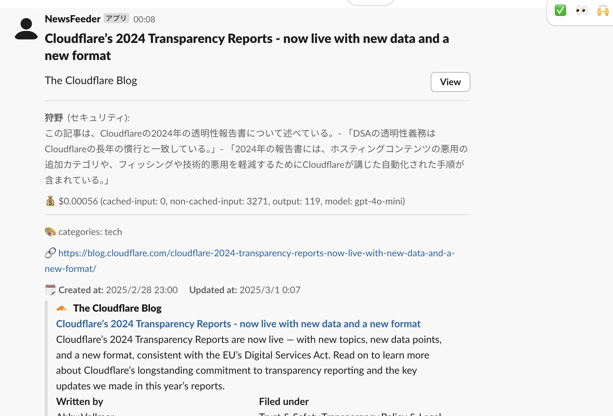

# 概要
RSS feed を登録できる [Miniflux](https://miniflux.app/)という OSS がある。
以前からこれを自鯖で運用していたのだけど、Slack に通知したくなった。
せっかくなので、LLM を使おうと思い、要約機能を入れてみたり、Coding Agent である Cline を使いながら開発してみたりした。

# 完成したアプリ

- [sasakiy84/harukaze](https://github.com/sasakiy84/harukaze)



現在利用できる機能は以下。

1. Miniflux から API を使って記事を取得
2. LLM を使って要約を作成
3. LLM を使ってどのチャンネルに通知するかを決定
4. Slack に通知

# 実装

## アーキテクチャ

コードのアーキテクチャとしては、平べったく実装するのではなく、一段階抽象化してある。
以下のようなフローになっている。
```plaintext
SourceProvider -> Plugins -> Notifier
```

各モジュール間で `Entry<T>[]` を引き回していくイメージ。

そして、SourceProvider の実装として Miniflux を、Plugins の実装として LLM を利用する Commentator を、Notifier の実装として SlackNotifier を実装している。
今後新しい記事の取得元を追加したくなったり、通知先を変える必要が出てきたら、該当する箇所だけを変更すればよいはず。

とはいえ、現状のような単一のフローしか使わなかったら、変更するコード量は結局変わらないか、むしろ増えるかもしれない。
ただ、それでも平べったく実装するよりはコードの見通しはずっといいので、結構満足している。

## Plugins の型
あまり満足がいっていないところ。

SourceProvider から `Entry<T>[]` が返ってきて、それを Plugins で処理して、`Entry<U>[]` を返す。
そして、`Entry<U>[]` を受け取る Notifier で処理して、通知する。
これが、理想の流れで、Plugins においては、`Entry<T>` から `Entry<U>` への変換を行うことになる。
ただし、直接的に変換されるとは限らず、`Entry<V>` を経由したりして変換されるかもしれないし、`Entry<T>` のまま変わらないこともあり得る。

以上を考えると `buildPluginApplyer` みたいな関数があり、それは以下のようなシグネチャを持っていてほしい。
```typescript
function buildPluginApplyer<T, U>(plugins: Plugin[]): Plugin<T, U>
```

これは、Plugin の配列を受け取って、一つ目の Plugin から順に適用していく関数を返すものである。
返り値の Plugin は、`Entry<T>` を受け取って、`Entry<U>` を返す関数である。
ここで、`Entry<T>` とは、引数で受け取った Plugin の配列の一番最初の `Plugin` が受け取る型であり、
`Entry<U>` は、引数で受け取った Plugin の配列の一番最後の `Plugin` が返す型である。
そして、当然行列計算のように、n 番目の Plugin が受け取る型は、n-1 番目の Plugin が返す型である。

以上のことを型レベルで表現したかったのだが、たぶん TypeScript では難しいんじゃないかと思っている。
これを表現できる言語や型クラス？があれば知りたい。

行列計算だと、依存型なるものを使えば行列の積の計算をうまく表現できるというのは聞いたことがあるが、
依存型を今回のような事例に使うことができるのかはわからない。

似たようなアーキテクチャとして、`unified` というライブラリ群があるけど、あれも型レベルではプラグイン機構を表現できてなかったと思うんだよな。

## エラー処理
各モジュール間で `Entry<T>[]` を引き回していくんだけど、それぞれのモジュールが errorHandler, successHandler を返すことができる。
これは、一番最後の Notifier で通知がうまくいかなかったときに、一番最初のモジュールでエラーハンドリングをしたいことがあったから。
具体的には、記事をどこまで通知したかを管理する `lastFetchedTime` を通知が失敗したときにはフォールバックさせたい。

こういうエラーハンドリングの構造はみたことがないんだけど、結構柔軟性がありいい感じなのではないかと思っている。
他に実装はないのかしら（みたことがないと言えるほど、コードを漁っているわけではないけど）。

## Miniflux
API が提供されていてありがたいのだが、少し困ったのは「いい具合に」フィードを取得するにはどうすればいいか、ということ。
本家の記事の公開時間と、Miniflux の巡回時間には差があり、かつフィードごとでも巡回時間にばらつきがある。
そのため、単純に公開時間でフィルタリングすると、抜け落ちてしまうフィードがある。
公開日が遥か未来に設定してあるエントリもあったりする。

一方で、Miniflux への登録時間や登録 ID を使うこともできない。
というのは、新しくフィードを追加したときに、そのフィードのエントリがすべて新しく登録されてしまうので、
通知が大量に送信されてしまうことになる。

結局、Miniflux に 1min 以内に登録されて、かつ公開時間が 1 day 以内のエントリを通知することにした。


## LLM の要約
機能として、とりあえずつけてはいるが、あまり納得のいっていない機能。
プロンプトを頑張ったり、複雑なアーキテクチャを組む気も起きなかったので、妥協の産物。

本当は、記事に対してアニメや小説の好きなキャラがコメントするような機能をつけたかった。
知的なキャラが鋭い考察をしたり、元気なキャラが見ていて楽しい反応をしたりするのを見たかった。
ただ、現状それをやると、想像と違ったときに幻滅しそうなのでやめた。

では、このためだけに作った人物なら幻滅しないかな、と思って、新しいキャラの設定を考えて、彼らにコメントをお願いしてみた。
こんな感じのが複数人いる。
8割くらい LLM に考えてもらっている。

```json
{
    "name": "X.synta",
    "field": "プログラミング言語論",
    "details":
        "本名は句須心多。落ち着いた、思慮深い青年。25歳。プログラミング言語の意味論・構文論が興味の中心にあり、特に型システムや関数型プログラミングに関心が深い。コンピューターサイエンス全般に詳しく、形式言語やオートマトン理論の知識も豊富。語学にも堪能で、人工言語と自然言語の違いを比較するのが趣味。ビッグテックで開発者支援のインターンをしており、ソースコードの美しさとエレガントなアルゴリズムにこだわる。",
}
```

この試みは上手くいかなかった。
まず、LLM が生成する文体を整えるのに一苦労。いきなり関西弁になったり、ですます調とである調が混在したり。
次に、コメンテーターとして求めることをしてくれない。
何も言わないと過度に記事を礼賛する。
一方で、きちんと批判してと伝えると、記事の文脈を踏まえずに、集約型の記事に対して「他の情報を参照しているだけ」とか言ってくる。

とはいえ、ここらへんはアルバイトで培ったプロンプト芸ぢからで何とかなりはする。

ただ、ある程度文体が安定しても、コメントの非有用性には困った。
読んでいて面白い、興味深いと思うコメントが全くない。
ちょっと目を引くコメントがあっても、言っていることがめちゃくちゃで、何も知らない外野の人がクソリプをしているみたいになってしまう。

おそらく、これを解決するためには、RAG のような感じで記事以外の外部データへのアクセス機構や、個々のキャラクターに独自のデータソースを持たせる機構などを作る必要があるのだろう。
少なくとも、リクエスト一回という制約でプロンプト芸で解決するのは難しそうだった。

ということで、当たり障りのない要約機能をつけた。
一文への要約くらいの大雑把な粒度なら間違えないだろうというのと、英語記事に対しては先にある程度概要を把握できるというのは便利かなと思っている。

ちなみに、やはりモデルは 4o-mini より 4o のほうがいいコメントが出てくる。
ただ、日常遣いお試しツールにそこまでお金をかけたくないので、4o-mini を使っている。

4o だと、一記事に対して 0.005 ドルくらい。高くて 0.01 ドルとか。
高めに見積もると、100 記事を要約すると 1 ドルくらいかかる。
いや、まあ別に払えないわけではないんだけど、まだ様子見でいいかなという。

## LLM の料金
openAI の API は各リクエストのレスポンスに usage の情報があり、そこに利用したトークン数が含まれている。
これを使って、リクエストごとに料金を計算することができる。

なので、それぞれのリクエストに対して、料金を以下のような形で表示することができる。
```plaintext
$0.00592 (cached-input: 1664, non-cached-input: 749, output: 197, model: gpt-4o)
```

これは、心の安全的にいい感じ。ちなみに 4o-mini だと以下のようになる。
文字通り桁が一つ違う。

```plaintext
$0.00030 (cached-input: 0, non-cached-input: 1590, output: 110, model: gpt-4o-mini)
```

ところで、1M token ごとの料金は以下のようにハードコーディングしている。
料金が変わったときに、変更するのが面倒だけど、しょうがないか。

```typescript
const buildOpenAICostCalculator = ({
    cachedRate,
    nonCachedRate,
    outputRate,
}: {
    cachedRate: number;
    nonCachedRate: number;
    outputRate: number;
}) => {
    return (usage: CompletionUsage) => {
        const cachedInputToken = usage.prompt_tokens_details?.cached_tokens || 0;
        const nonCachedInputToken = usage.prompt_tokens - cachedInputToken;
        const outputToken = usage.completion_tokens;
        const cost =
            cachedInputToken * cachedRate +
            nonCachedInputToken * nonCachedRate +
            outputToken * outputRate;
        return {
            cost: cost,
            cachedInputToken: cachedInputToken,
            nonCachedInputToken: nonCachedInputToken,
            outputToken: outputToken,
        }
    }
};

// https://openai.com/ja-JP/api/pricing/
const ONE_MILLION = 1_000_000;

const GPT4O_MINI_CACHED_INPUT_TOKEN_RATE = 0.075 / ONE_MILLION;
const GPT4O_MINI_NON_CACHED_INPUT_TOKEN_RATE = 0.15 / ONE_MILLION;
const GPT4O_MINI_OUTPUT_TOKEN_RATE = 0.6 / ONE_MILLION;
export const calculateGpt4oMiniCost = buildOpenAICostCalculator({
    cachedRate: GPT4O_MINI_CACHED_INPUT_TOKEN_RATE,
    nonCachedRate: GPT4O_MINI_NON_CACHED_INPUT_TOKEN_RATE,
    outputRate: GPT4O_MINI_OUTPUT_TOKEN_RATE,
});

const GPT4O_CACHED_INPUT_TOKEN_RATE = 1.25 / ONE_MILLION;
const GPT4O_NON_CACHED_INPUT_TOKEN_RATE = 2.5 / ONE_MILLION;
const GPT4O_OUTPUT_TOKEN_RATE = 10 / ONE_MILLION;
export const calculateGpt4oCost = buildOpenAICostCalculator({
    cachedRate: GPT4O_CACHED_INPUT_TOKEN_RATE,
    nonCachedRate: GPT4O_NON_CACHED_INPUT_TOKEN_RATE,
    outputRate: GPT4O_OUTPUT_TOKEN_RATE,
});
```

ついでにいうと、カリー化を TS で初めて実践投入したかも。

あとは、一工夫として、わざと `Promise.all` を使わずに、シーケンシャルにリクエストを送るようにしている。
これは、キャッシュにできるだけヒットするようにするため。
ただ、直後に送るとうまくキャッシュにひっかからないことがある。


## AI Coding Agent
AI Coding Agent として Cline を使ってみた。
なお、使っていたのは主に GitHub Copilot の GPT4o モデル。

明らかにコーディングは速くなった。けど、そこまで賢いという感じはしない。
GitHub Copilot を正当進化させた、超超高度な補完機能という感じ。


具体的には、少し高度な型パズルをやってもらおうとしたら永遠におなじ更新を試し続けていたり、
変えてほしくないところを変えてしまったり。ブルドーザーで全てを薙ぎ払っていくイメージ。
ガッとできるところはできるけど、繊細な作業には向いていないといった。

ただ、とても便利だー、と思った箇所はあって、それは一通り実装したあとに抽象度をあげようとして以下のようなプロンプトを与えたとき。

```text
もう少し汎用的なシステムにしたいです。現状は記事ソースとして miniflux をハードコードしていますが、これを SourceProvider -> Plugin -> Notifier というように抽象化してリファクタリングしたいです。現状の miniflux は SourceProvider, Slack 通知は Notifier という形になると思います。
```

15 分程度で関数の切り分けやシンボル類のリネーム、ファイル分割などを行って、エラーを解決するところまでやってくれた。
ただ、その後に型引数を考えさせるところまでやってもらうと、エラーを直せずにループしてしまったけど。

最終的には、型引数周りを自分がなおしつつ、[このコミット](https://github.com/sasakiy84/miniflux-slack-adaptor/commit/02973aa3efdefc082959105b6c4a54bec8ab637d)を 1h20m 程度で作成できた。

思考的に面倒くさい部分ではなくて、労働的に面倒な部分を助けてくれるのは本当にありがたい。
すでにあるブロックを使ってなんやかんややるのは結構得意そうで、ある程度信頼して任せられそうな感じなので、どれだけ綺麗にブロックを作ってあげられるか、みたいな話になるのかな。

あとは、セキュリティ的に怖くてブラウザへのアクセスを許可していない。これを許可すると、もう少し事情は変わる気がする。

なんだかんだ、自然言語で頼んで、牛乳を啜ってる間にコードができるという体験は面白かった。

# TODO
やりたいことメモをまとめておく。

- もう少し LLM にいい使い方がないか
    - 分類と要約だけというのはあまりにもオーソドックスすぎる
    - 要約もべつにうまくできるわけでもないし
    - 日次、週次のレポートとか
    - 記事に対してキャラクターの掛け合いとか見てみたいけど、既存のキャラクターだとハルシネーションが起きたときに幻滅して萎えてしまう
        - ハルシネーションを起こさないようにする、というのは望み薄
        - バカポジションのキャラを使えば気にならないかもしれない。今言うなとか、テレーゼ・マトハズレイとか
    - フィルタリングをさせてもいいかもしれない
        - 宣伝目的の記事とか、日常の記事とかはあまり必要ない
    - 小説とかエッセイを書いてもらうとか
        - 一行日記というか、千文字会話というか
        - 現実世界の動きにある程度連動しつつ、日常系の小説を書いてもらうのは面白そうではある
            - やっぱり千文字会話的なのが理想だよな
  - miniflux 以外のデータソースを追加する
      - 流量が多いデータソースを選んで、それをデイリーニュース、ウィークリーニュースとしてまとめるとか
      - RSS を提供していないサイトの一覧を作って、それをスクレイピングして LLM
        に最近の更新がありそうかをみてもらうとか
          - 日付さえあれば、適切にフィルタリングできそうではある
      - 各国の主要メディアをヘッドラインを取得して、それを翻訳してもらうとか
          - 新聞は見出しをみるだけで効果があるとかいうし
      - ランダムに過去の RSS を検索したりして、おすすめしてくるとか
      - 図書館とか出版社、論文誌の新着図書・記事を監視して、面白そうな本があれば紹介するとか
  - ユーザーからの何らかのアクションを受け取って動作する機能
      - せっかく web socket のコネクションを貼ってるし
      - すぐに思いつくのは、LLM battle みたいな
          - まあ情報収集の指示を出すという意味では、ハルカゼの世界観に合ってはいるし
