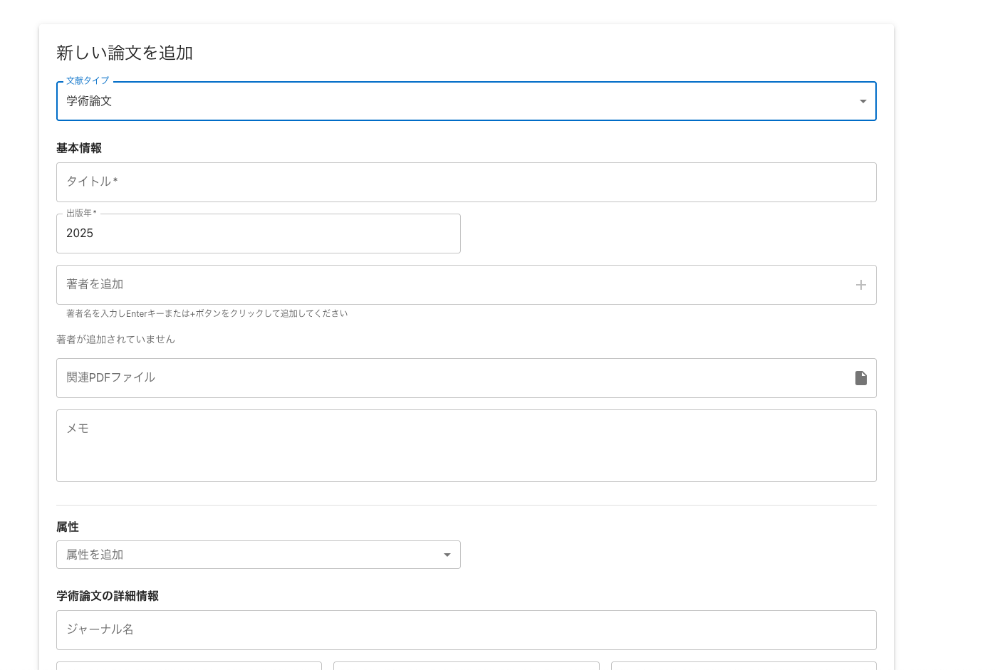
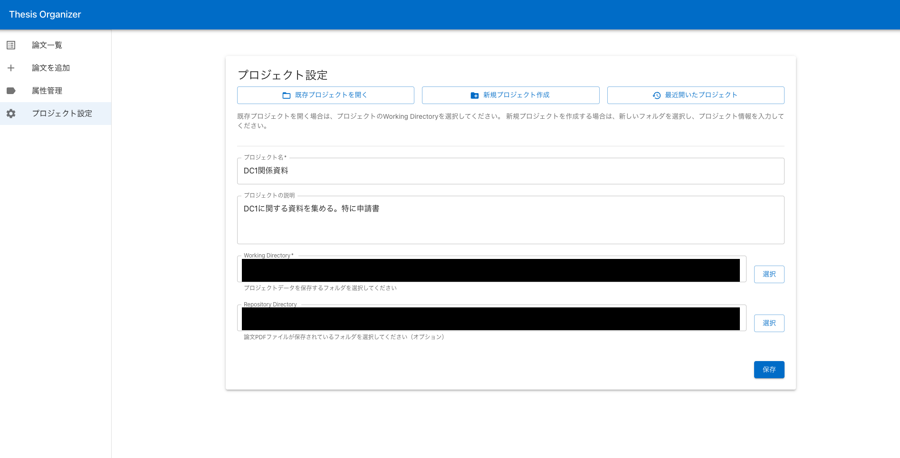

# 発端

現在、レビュー論文を書いている。
文献をある程度集め終わって、それをきちんと読んで、どのようにまとめていくかを考える段階。
まとめ方を考えるときに、頭の中だけで考えても難しいので、うまいやり方がないかというのを考えていた。

やりたいことは、文献とタグを N:N で紐づけること。
例えば、文献 A は Methodology として X, Y を採用していて、文献 B は Y, Z を採用している、といった感じ。

これは、紙でやると結構面倒だし、いろいろな分類を試す段階では機動性に欠ける。
特に文献が 100 を超える状況で、タグの種類も 10 以上想定されるため、紙の利点である一覧性を殺さない形で整理することが難しい。

文献リストは Spreadsheet で管理しているので、そちらでできればよいのだが、微妙に使い勝手が悪い。
特に、一つの文献に複数のタグをつけることが難しい。
いや、もちろん手書きで、一つのセルの中にカンマ区切りとかで書いていけばよいのだけれど、せっかくデジタルなので、いい具合にボタンをぽちぽちと押せば、表記統一された、分析しやすい値がセルに書き込まれてほしい。

Spreadsheet には、データの入力規則機能でプルダウンが作れる。
しかし、それは multi select には対応していない。

ということで、自分でカスタマイズできるような、ローカルで動く文献管理アプリが作りたいと思っていたことも相まって、デスクトップ文献管理アプリを作ることにした。

# 成果物

これは学振関係の資料を試しに管理してみている図。
学振はべつにタグづけが重要ではないから、ほぼ意味がないのだけれど、テスト用ということで。







# 技術の話

Electron の React + Vite + TypeScript のテンプレートをもとに作成した。
整ったエコシステム万歳。

また、コンポーネントライブラリとして Material-UI を使った。
正直なんでもよかったのだけれど、Claude Code に任せる予定だったので、古くからあって、情報量が多そうなものを選んだ。
長く使っていくなら、自前で CSS を書いていくのだけれど、ほぼ使い捨てツールのつもりだったので。
あと、自前の CSS は記述量が多くて、Claude Code を使うとトークン量が増えそうというのもあった。

結果、これぞまさに Material-UI という感じのデザインになったけど、まあいいでしょう。

# 仕様の話

わかっている人（自分）しか使わない予定だったので、そこそこ尖った仕様で作った。
以下は、初期に README に書いた仕様。最終的には少し変わっているが、概ね以下の通り。

```
# thesis organizer

このアプリケーションは、
論文を整理するための補助アプリケーションで、
以下の機能を持ちます。

- Working Dir の設定：このフォルダに JSON 形式でデータを保存します
- Repository Dir の設定：論文の PDF ファイルが保存されているフォルダを指定します。このフォルダをルートとして、論文に PDF を紐づけることができます
- 論文のメタデータの追加と、それに対しての属性の追加

## 使い方
以下のような使い方を想定しています。

1. Project の設定。Working Dir を設定して、そこにそのプロジェクトのメタデータを全て保存する
  - プロジェクト名
  - プロジェクトの説明
  - Repository Dir の設定
2. 論文の追加
  - 論文のメタデータを追加します。種別、タイトル、著者、年、リンク、出版社、ページ数などです。これらは、JSON Schema で定義され、時系列に沿った ID を付与されます。そして、その ID をファイル名として、Working Dir に JSON で保存されます
  - Repository Dir にあるファイルを紐づけることも可能です。これは、単に紐づけるだけです
3. 論文の属性の追加
  - 属性のスキーマを以下のような形式で定義します。属性の定義は、Working dir の schema.attributes.json に配列で保存されます
    ```
    {
      "attributeName": string,
      "values": string[]
    }
    ```
  - 定義した属性を、論文に追加することができます。論文の attributes フィールドに以下のような形式で保存されます
    ```
    {
      "attributeName": string,
      "values": string[],
      "note": string
    }
    ```
4. 属性情報のエクスポート
  - tidy data 形式で、属性情報をエクスポートすることができます。たとえば、以下のような形式です
    ```
    id, attribute, value
    1, subject, computer science
    1, subject, machine learning
    2, subject, computer science
    1, methodology, deep learning
    2, methodology, bayesian statistics
    ```
  - 入力補助用のアプリケーションのため、このアプリケーション自体でなんらかの分析を行うことは想定していません。
```

特に、以下の点は特徴的に思う。

- すべてをファイルベースで管理している。メタデータは JSON で、PDF は普通にファイルシステムに保存されている
    - これにより、人間が手で見て編集できるし、バックアップも取りやすい。アプリケーションが動かなくなったり、他のアプリケーションに移行する際にも、データの移行が容易
    - メタデータはテキストベースなので、他のアプリケーションとの連携も容易
    - 懸念の一つは、データの整合性。たとえば、属性の名前を後から変更しても、その属性を登録済みの文献に紐づけられている値が勝手に変わるわけではない。これは、そういうものとして割り切っている
    - 懸念の二つは、パフォーマンス。たとえば、一覧表示するためには、ディレクトリのすべての JSON を読み込む必要がある。データ量が増えてくれば使い物にならなくなるとは思うが、数千件もファイルを登録するような使い方を想定していない。たかだか数百件程度（300を超えるかすら怪しい）という想定なので、問題ないだろうと考えている
- 分析のパートは外部に任せている。登録のためだけのアプリケーション
    - 論文整理の一工程で使うためのアプリケーションであって、パイプラインの一部である
    - エクスポートは [tidy data](https://vita.had.co.nz/papers/tidy-data.pdf) 形式にしている。これを Python などで読み込んで、分析を行う
- PDF はファイルシステムにマウントされたクラウドストレージを利用できる
    - やはり、ネットワークを気にせずに使いたい
- 複数プロジェクトを前提としている
    - 逆に言えば、すべてをまとめた巨大プロジェクトを想定していない
    - 研究プロジェクトごとにフォルダを作り、その中で管理する
    - 身軽さは美徳

# 作成プロセス

9割9分を Claude Code に書いてもらった。
最低限の一連の機能が動くようになるまでで、2.5h くらいだと思われる。費用にして、およそ $10 くらい。
その後、細かい修正をいろいろしたら、プラスで 1.5h くらい。費用にしておよそ $5 くらい。
合計すると 4h 程度、$15 くらいで、このアプリケーションが完成した。

自分が関与したところは、以下の通り。

1. 環境構築。テンプレートを使って、プロジェクトを作成し、必要なライブラリをインストール
2. サイドバー周りの CSS の調整。1-2 回指示を与えてみたが、解決できなかったので、自分で原因を調査して、コードレベルで修正の仕方を伝えた
    - 具体的には「main の width は 100% でいいです。サイドバーを考慮して 240px のマージンを取る必要はありません」という指示を与えた
3. 提案してきたライブラリ追加を拒否。入れなくてもできることを、入れてやろうとしてた
4. 属性を一つ選ぶと、他の属性が選べなくなってしまうバグの修正方法の提示
    - 参考にするべき実装の箇所を提示しただけ
    - 「AttributeSelector の中で Chip で他の定義済みの値を選択できるのと同じ機能を、renderAttributeSection のコンポーネントでも追加してください」という指示
5. 筋の悪い実装になってしまったときに、一度コンテキストをクリアして、詳細な指示を与えること
    - 「最近開いたプロジェクト」機能は、一度目の指示では筋が悪い実装になってしまい、$2 くらい溶かしてもエラーを修正できなかった
    - コンテキストをクリアして、次のように手順を具体化した指示を出した
        - 「最近開いたプロジェクト機能を実装したい。プロジェクト管理メニューに、最近開いたプロジェクトボタンを追加する。そのボタンを押すと、最近開いたプロジェクトのリストが表示されて、選択することで、そのプロジェクトを開くことができる。プロジェクトの履歴は、OS が用意するアプリケーション用のディレクトリに保存する。electron のapp.getPath('userData') で取得できるディレクトリに、プロジェクトの履歴を保存する。履歴は、project-history.jsonというファイル名で保存する。JSON には配列形式で、最新の20件を保存する。配列の要素には、プロジェクト名、開いた日時、プロジェクトのディレクトリを保存すればよい。」
    - ちなみに、一度目の指示はこちら
        - 「Workind Dir の履歴を保存して、以前開いたプロジェクトはすぐに開けるようにしたいです。historyファイルをapp.getPath('userData')を使って作って、「過去のプロジェクトを開く」メニューを作成してください。historyファイルには、最後に開いた時間、フォルダの場所、プロジェクト名が json で保存されていればよいです。」

## 与えた指示一覧

その指示をした後に `/cost` をしていたときは、カッコの中に total cost, total API duration の順番で書いている。

1. アプリを作成しましょう。まずは、README の 1. Project の設定。Working Dir を設定して、そこにそのプロジェクトのメタデータを全て保存するまでを作ってみてください。動作確認は私がやります。必要なものはすべてインストールしてあるはずです（$0.2625, 1m 57.6s）
2. コミットしてください（$0.3166, 2m 39.8s）
3. 論文メタデータの追加機能をお願いします。論文には、雑誌論文に限らず、本や雑誌記事、博士論文などが含まれます。型定義では type フィールドを作成して、篩型ようなことができるようにしてください。また、タイトル、出版年、著者、メモの必須項目は、CommonMetadata として、きちんと切り分けてください
4. [plugin:vite:import-analysis] Failed to resolve import "@mui/icons-material/Add" from "src/components/literature/LiteratureList.tsx". Does the file exist? というエラーが出ます
5. 各 type の詳細情報は optional にしてください。差し当たって、commonMetadata  さえきちんと保存されていればいいです
6. main の width は 100% でいいです。サイドバーを考慮して 240px のマージンを取る必要はありません
    - これでも解決しなかったので、ソースをみて自分で修正する
7. では、ここまでを保存してください（$1.61, 9m 51.5s）
8. `/compact` （$1.89, 10m 9.1s）
9. attribute 機能を作成してください。このとき、各attributeのスキーマは、ソースコードに書くのではなく、JSON Schema に [id].attribute-schema.json のような形式で保存してください。node:fs/promises には glob API が v22 から追加されているので、読み取りのときにはそれを使うとよいでしょう。glob(pattern[, options])pattern: stringまたはstring[]。string[]の場合、いずれかのパターンにマッチするようなパスを列挙するoptions: Objectまたはundefinedcwd: ワーキングディレクトリ。省略した場合process.cwd()exclude: 関数またはstring[]。ただし、string[]はv23.7.0以降のみ。除外するパスのパターンを指定できるwithFileTypes: boolean。trueにした場合、パスがDirentとして返る。そうでなければstringが返る。そして、attribute の JSON schema は UI から追加できるようにしてください。さらに、value に入る値は、literal で選択肢がありつつ、string 型で自由記述する可能性もあります。単なる multiselect を使わずに、現在の論文登録画面の author のような形式の UI にしてください。
    - glob は知らないかなと思って、https://koyomiji.com/log/116 から適当に説明を引っ張ってきた
10. 論文追加時と同じやり方で ID を生成してください
    - `uuid` パッケージをインストールすると言われたのに対する応答
11. 属性スキーマ一覧の取得に失敗しました: TypeError: schemaFiles.map is not a function  と出ます。また、これはコンソールにのみ表示されて、フロント側へのフィードバックがありません
    - これは、実は ` npm run start` で再起動すれば解決するやつだった
12. 現在の構造を CLAUDE.md に保存した上で、commit してください
13. 次に、論文の詳細画面を追加してください
14. PDF ファイルはクリックすると所定のアプリケーションで開くようにしてください。
15. また、ソースの JSON ファイルを開くボタンと、絶対パスをコピーするボタンも作成してください。
    - ここで、`You've spent $5 on the Anthropic API this session. Learn more about how to monitor your spending: https://docs.anthropic.com/s/claude-code-cost` と表示される。心配してくれてる
16. では、ここまでを保存してください（$5.47, 25m 59.2s）
17. `/compact` （$5.97, 26m 26.0s）
18. 文献の編集画面を追加してください
19. 編集画面で属性に一つ値を付与すると、他の値を選べなくなります。たとえば、subject の属性を選んで、「算数」の選択肢ボタンを押すと、「国語」のボタンが消えてしまいます
    - 修正されないので、コードを見て具体的に指示する
20. renderAttributeSection のコンポーネントでも、AttributeSelector の中で Chip で他の定義済みの値を選択できるのと同じ機能を追加してください
21. では、ここまでを保存してください（$7.59, 33m 15.8s）
22. `/clear`
23. README を参照して、属性情報のエクスポートを実装してください。
24. フロントエンド側でも実装してください。属性管理の画面から、一括エクスポートと、個々の属性のエクスポートをできるようにしてください。また、属性の他にも id, title, year, author, filename, filepath を選択式でエクスポートできるようにしてください
25. attribute の列に、value が入ってしまっています。たとえば、attribute は subject, value  は国語のようになってほしいです
26. コミットしてください（$8.65, 39m 57.2s）
27. プロジェクト切り替え、新規作成ボタンを作ってください。切り替えの場合は、Working Dir を指定して、読み込みます。新規作成の場合は、フォルダを指定して、最初のセットアップをします
28. コミットしてください（$9.08, 42m 36.3s）
29. Literature の JSON ファイルは、Working dir の中にそれ専用のフォルダを作って、そこで、[id].literature.json という形式で保存、読み込みをするようにしてください。この変更は後方互換性を考えなくて構いません
30. コミットしてください（$9.29, 44m 0.2s）
31. `/clear`
32. 論文一覧画面にタイトル、著者、出版年で検索できる機能をつけてください
33. React には useDeferredValue というのがあります
    - VS code のソースコード検索で、`useDeferredValue` を調べて、使っていないことを確認した
34. コミットしてください（$9.68, 46m 23.3s）


以上で、一定程度使えるものができたので、セッションを終了した。
最終的には、以下のようになった

```
> /cost 
  ⎿  Total cost:            $9.68
     Total duration (API):  46m 23.3s
     Total duration (wall): 3h 9m 54.4s
     Total code changes:    5937 lines added, 276 lines removed
```

さらに、ちまちまと以下の機能を実装してもらった。あまりメモはとっていない。

- table にタグなどを表示
- ページ数や検索クエリなどを main process 側に持ってきて、他のページに移動しても状態を維持する
- 最近開いたプロジェクト機能

これらの機能追加のメトリクスは以下。

```
> /cost 
  ⎿  Total cost:            $4.06
     Total duration (API):  21m 35.8s
     Total duration (wall): 2h 43m 35.1s
     Total code changes:    1200 lines added, 226 lines removed
```


## 雑多なメモ
- お金は溶けていくけど、本当に便利。十分コストに見合っていると思う
- `/compact` 自体に結構お金を取られる、$0.5 前後？
- やはり、必要があればソースコードであったり、検証画面を見て、自分でなんとかできる能力は必要。
- 6000 行程度（`git ls-files | grep -E ".ts|.tsx" | xargs wc -l`）のコードベースなら、全く問題なく動くが、これが増えてきたときにどうなるか

# オチ

というわけで、デスクトップアプリができた。
のだけれど、Google App Script で、セルをクリックしてカスタムメニューからモーダルを開いて、タグを選択して、それをセルに書き込む、というのをやれば、十分使えるものができるのでは。

と思って、[やったらできてしまった](https://blog.sasakiy84.net/articles/20250328-spreadsheet-multiselect/)。
tidy data 形式でダウンロードはできないのだけれど、そこはローカルでスクリプトを書けばなんとでもなる。