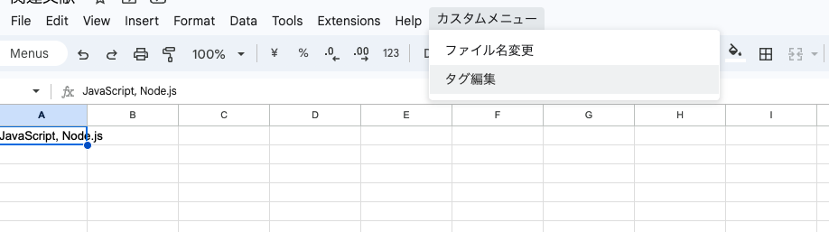
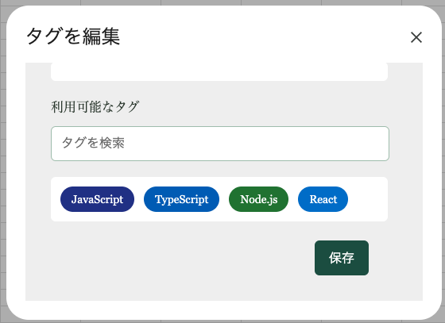
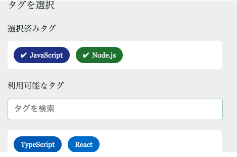

# 成果物

セルを選択して、カスタムメニューから「タグ編集」を選択すると、以下のようなモーダルが開く。





タグをクリックすると選択や解除ができ、保存ボタンを押すと、選択したタグがカンマ区切りでセルに書き込まれる。



「利用可能なタグ」は、シート名と列名に対応するタグが表示される。
タグの背景色や文字色も、それぞれのタグに対して設定できる。
保存される値は単なるテキストなので、応用が効く。

タグの設定方法は、以下のコードの「タグの定義」部分を参照すること。

# 実装方法

GAS ファイルに以下を記述する。

```javascript

// タグの定義
const COLUMN_TAGS = 
// 色を指定するのは面倒くさいので、
// 以下のようなプロンプトをもとに LLM に生成してもらうことを想定している。
// tag 名にカンマは使えない
// シート名は、実際のシート名と一致している必要がある
// ---- プロンプト例 ----
// 
// 与えられたタグ名を用いて、以下の構造に沿った JavaScript の配列を出力してください。
// 
// ```typescript
// type Tag = {
//   tagName: string;
//   backgroundColor: string;
//   fontColor: string;
// }
// 
// type Column = {
//   columnName: string; // A, B, C, ...
//   tags: Tag[];
// }
// 
// type Sheet = {
//   sheetName: string;
//   columns: Column[];
// }
// 
// type ColumnTags = Sheet[];
// ```
// 
// ## 制約条件
// 
// - タグは文字が読みやすく、視認しやすい色使いにしてください。
// - 基本的に、文字の色は白とし、白抜き文字が見えやすいような背景色にしてください。
// - タグ名にカンマは使えません。
// - シート名は、実際のシート名と一致している必要があります。
// - タグ名から想起される色を使うほうがよいですが、必須ではありません。
// 
// ## タグの指定
// 
// シート名「シート１」、列番号「A」 には以下のタグを指定してください。
// JavaScript,
// TypeScript,
// Node.js,
// React,
// 
// シート名「シート２」、列番号「B」 には以下のタグを指定してください。
// HTML,
// CSS,
// Sass,
[
  {
    sheetName: "Sheet1",
    columns: [
      {
        columnName: "A",
        tags: [
          {
            tagName: "JavaScript",
            backgroundColor: "#283593",
            fontColor: "#ffffff",
          },
          {
            tagName: "TypeScript",
            backgroundColor: "#1565c0",
            fontColor: "#ffffff",
          },
          {
            tagName: "Node.js",
            backgroundColor: "#2e7d32",
            fontColor: "#ffffff",
          },
          {
            tagName: "React",
            backgroundColor: "#1976d2",
            fontColor: "#ffffff",
          },
        ],
      },
    ],
  },
  {
    sheetName: "シート２",
    columns: [
      {
        columnName: "B",
        tags: [
          {
            tagName: "HTML",
            backgroundColor: "#d32f2f",
            fontColor: "#ffffff",
          },
          {
            tagName: "CSS",
            backgroundColor: "#ad1457",
            fontColor: "#ffffff",
          },
          {
            tagName: "Sass",
            backgroundColor: "#6a1b9a",
            fontColor: "#ffffff",
          },
        ],
      },
    ],
  },
];

function onOpen() {
  const ui = SpreadsheetApp.getUi();
  ui.createMenu("カスタムメニュー")
    .addItem('タグ編集', 'openTagModal')
    .addToUi();
}


// 選択中のセルのシート名・列名を取得
function getSelectedSheetAndColumn() {
  const sheet = SpreadsheetApp.getActiveSpreadsheet().getActiveSheet();
  const range = sheet.getActiveRange();
  if (!range) return null;

  const sheetName = sheet.getName();
  const columnLetter = String.fromCharCode(64 + range.getColumn()); // 1 -> A, 2 -> B

  return { sheetName, columnLetter };
}

// 選択したシート・列に対応するタグ一覧を取得
function getTagsForColumn(sheetName, columnLetter) {
  const sheetData = COLUMN_TAGS.find(sheet => sheet.sheetName === sheetName);
  if (!sheetData) return [];

  const columnData = sheetData.columns.find(col => col.columnName === columnLetter);
  return columnData ? columnData.tags : [];
}


function openTagModal() {
  const sheetInfo = getSelectedSheetAndColumn();
  if (!sheetInfo) {
    SpreadsheetApp.getUi().alert('セルを選択してください。');
    return;
  }

  const { sheetName, columnLetter } = sheetInfo;
  const tags = getTagsForColumn(sheetName, columnLetter);
  const selectedTags = SpreadsheetApp.getActiveSpreadsheet().getActiveRange().getValue();

  const template = HtmlService.createTemplateFromFile('TagModal');
  template.tags = JSON.stringify(tags);  // カラー情報を含む
  template.selectedTags = selectedTags;

  const htmlOutput = template.evaluate().setTitle('タグを編集');
  SpreadsheetApp.getUi().showModalDialog(htmlOutput, 'タグを編集');
}


// 選択したタグを保存
function saveTags(tags) {
  const sheet = SpreadsheetApp.getActiveSpreadsheet().getActiveSheet();
  const range = sheet.getActiveRange();
  if (range) {
    range.setValue(tags.join(', '));
  }
}
```

`TagModal.html` は以下のように記述する。

```html

<!DOCTYPE html>
<html>
<head>
  <style>
    :root {
      --primary-bg: #f0f0f0;
      --tag-bg: #2e6658;
      --tag-text: #ffffff;
      --tag-hover-bg: #245749;
      --border-color: #aac4b4;
      --button-bg: #245749;
      --button-hover-bg: #1d4d3f;
    }

    body {
      font-family: 'Georgia', serif;
      background-color: var(--primary-bg);
      color: #2e3d30;
      padding: 24px;
      width: 400px;
    }

    h3, h4 {
      margin-bottom: 12px;
      font-weight: normal;
    }

    .search-box {
      width: 100%;
      padding: 12px;
      font-size: 16px;
      border: 1px solid var(--border-color);
      border-radius: 6px;
      background-color: white;
      margin-bottom: 20px;
    }

    .tag-container {
      width: 100%;
      display: flex;
      flex-wrap: wrap;
      gap: 12px;
      padding: 12px;
      border-radius: 6px;
      background-color: white;
    }

    .chip {
      padding: 8px 14px;
      border-radius: 20px;
      background-color: var(--tag-bg);
      color: var(--tag-text);
      cursor: pointer;
      transition: all 0.2s ease;
      font-size: 14px;
      position: relative;
    }

    .chip:hover {
      background-color: var(--tag-hover-bg);
    }

    .chip.selected {
      padding-left: calc(18px + 14px);
    }

    .chip.selected::before {
      content: '✔';
      position: absolute;
      left: 14px;
      font-size: 14px;
      font-weight: bold;
      color: var(--tag-text);
    }

    .button-container {
      text-align: right;
      margin-top: 24px;
    }

    button {
      background-color: var(--button-bg);
      color: white;
      border: none;
      padding: 10px 18px;
      font-size: 16px;
      border-radius: 6px;
      cursor: pointer;
      transition: background-color 0.2s ease;
    }

    button:hover {
      background-color: var(--button-hover-bg);
    }
  </style>
  <script>
    let selectedTags = [];
    const allTags = JSON.parse(<?= tags ?>);

    function init() {
      const existingTags = '<?= selectedTags ?>'.split(', ').filter(tag => tag.trim() !== '');
      selectedTags = existingTags;
      renderTags();
    }

    function renderTags(filter = '') {
    const availableTagContainer = document.getElementById('available-tags');
    const selectedTagContainer = document.getElementById('selected-tags');

    availableTagContainer.innerHTML = '';
    selectedTagContainer.innerHTML = '';

    allTags.forEach(tag => {
      const { tagName, backgroundColor, fontColor } = tag;
      const tagElement = document.createElement('div');
      tagElement.className = 'chip';
      tagElement.textContent = tagName;
      tagElement.style.backgroundColor = backgroundColor;
      tagElement.style.color = fontColor;

      if (selectedTags.includes(tagName)) {
        tagElement.classList.add('selected');
        tagElement.onclick = () => removeTag(tagName);
        selectedTagContainer.appendChild(tagElement);
      } else if (tagName.includes(filter)) {
        tagElement.onclick = () => addTag(tagName);
        availableTagContainer.appendChild(tagElement);
      }
    });
  }

  function addTag(tagName) {
    selectedTags.push(tagName);
    renderTags();
  }

  function removeTag(tagName) {
    selectedTags = selectedTags.filter(t => t !== tagName);
    renderTags();
  }

  function searchTags() {
    const filter = document.getElementById('search').value.trim();
    renderTags(filter);
  }

  function saveTags() {
    google.script.run.saveTags(selectedTags);
    google.script.host.close();
  }
  </script>
</head>
<body onload="init()">
  <h3>タグを選択</h3>
  
  <h4>選択済みタグ</h4>
  <div id="selected-tags" class="tag-container"></div>

  <h4>利用可能なタグ</h4>
  <input type="text" id="search" class="search-box" placeholder="タグを検索" oninput="searchTags()">
  <div id="available-tags" class="tag-container"></div>

  <div class="button-container">
    <button onclick="saveTags()">保存</button>
  </div>
</body>
</html>
```

保存して、Spreadsheet をリロードする。

`カスタムメニュー` が追加されているので、`タグ編集` をクリックすると、モーダルが開く。


# 雑談

## LLM に作ってもらった
前からこういうものがあればいいと思っていたのだけれど、腰が重かった。
LLM に作って貰えばいいじゃないと思い、ChatGPT 4o さんの無料枠で作ってもらったのだが、だいたい 1h かからないくらいでできた。
デザインにこだわらなければ、10min もかからなかったと思う。
いい時代。おそらく、すぐにいちいち LLM に作ってもらったとか書かななくなるのだろうけど。

なんとなく、ChatGPT 系統は Claude 系統よりも HTML, CSS のコーディングが下手な気がする。
Claude Sonnet 3.7 は初手で 80 点くらいのものを出してくれるのに対して、ChatGPT 4o は 50-60 点くらいのものな気がする。

## 値を埋めた後のこと
ところで、これを利用して値を埋めていくと、あまり綺麗なデータにはならない。
たとえば、Spreadsheet の便利機能の一つである、列の統計情報が使い物にならなくなる。
分析パートでは、これを tidy data などの形に変換してあげる必要があるだろう。

そもそも、Spreadsheet が扱うのはテーブルデータであって、一つのセルに複数の値を入れることを想定していない。
本来なら正規化して、テーブルを分割するべきところを、無理をおして一つのセルに複数の値を入れているので、こちらが悪い。

## デザインの話もしたい
マルチセレクトの UI は、このタイプが気に入っている。
タグがすいすい動いていくのが気持ちいいし、拡張性も高い。
タグの数が増えてきても検索すればいいし、よく使うもの順に並べておけばそこまで困ることもない。

現在、HTML の世界では customizable select の実装が進んでいるが、そちらが普及しても、このタイプの UI を実装する気がする。
ただ、一つ気になるのは、アクセシビリティの観点から何か問題はないのだろうかということ。
キーボード操作で考えると、上下移動して決定キーで選択を切り替えるという方がやりやすい気がする。
それを考慮に入れる必要があるアプリケーションでは、実装できないかもしれない。
