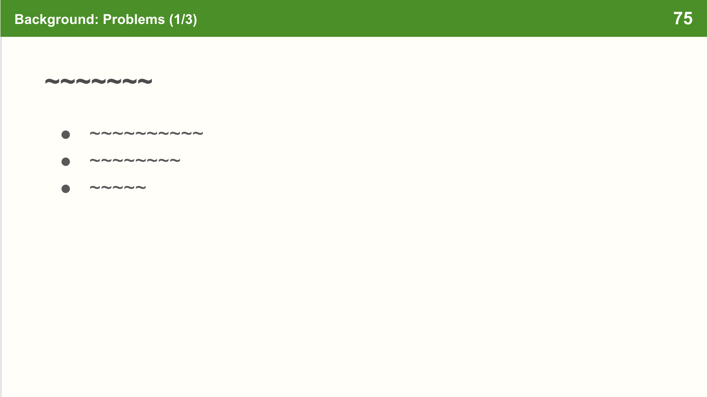
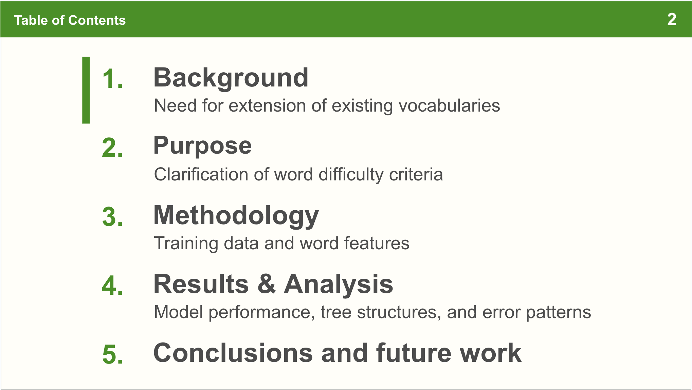

# 概要
学会発表スライドを作成するときのチェックリストや Google Slide の使い方についてまとめる。
学会発表以外でも、あるいは Google Slide 以外でも、プレゼンテーション資料を作成するときに参考になるはず。

# チェックリスト
## デザイン（最低限）
- フォントサイズが適切か（目安として 20pt 以上がよいとされている）
- フォントの種類が統一されているか（遠くからでも見やすいフォントになっているか）
- 利用する色の種類が多くないか（ベースの色は 2~3 色程度が望ましい）
- 画像の解像度は適切か
- 全てのページにページ番号が振られているか
- アニメーションを使いすぎていないか（不必要な拡大縮小、回転などが入っていないか）
- 研究の内容に直接関わりのない画像が入っていないか（不必要なイラストやの利用）
- 図表の説明が十分か（図表のタイトル、軸ラベル、凡例などが入っているか）
- 目次やトランジションスライドが入っているか
    - 目次は、スライドの構成を理解しやすくするために入れる
    - 新しい章や節に入るときには、トランジションスライドを入れることで、聴衆に次の話題が始まることを知らせることができる
- スライドの端に余白があるか
    - 会場の投影機器によってはスライドの端が切れてしまうことがある
- ユニバーサルデザインに配慮されているか
    - 色だけで情報を伝えていないか。太字にする、フォントサイズを変える、囲み枠をつけるなど、色以外の方法でも情報を伝える

## デザイン（応用）

- ジャンプ率を考慮できているか
    - タイトルは大きく、本文は小さく
- 要素間の余白を適切に設けられているか
- 要素の端が揃っているか
    - スライド作成ツールの整列機能を使っても、フォントや囲み枠の設定によって揃わないことがあるため、目視で確認する
- 図やグラフはスライド発表に適した見やすいものになっているか
    - Python のライブラリなどから出力された図やグラフは、そのままスライドに貼り付けると見づらいことがある
    - 必要であれば、デザイン機能が豊富なツールで図やグラフを作成し直す
- 現在どのような位置付けで説明をしているかを、聴衆が途中から見ても理解できるレイアウトになっているか
    - たとえば、上側にスライドの現在位置を示す

## 倫理

- 利用したデータが第三者のものである場合、適切な参照を行っているか
- 利用した画像が第三者のものである場合、適切な参照を行っているか
- 利用した文言が第三者のものである場合、適切な参照を行っているか
- 言及しているツールやライブラリが第三者のものである場合、適切な参照を行っているか
- フリー素材を利用している場合、利用規約に違反していないか
    - たとえば、いらすとやは商用利用の場合、一つの資料に 20 点までの制限がある（[参考](https://www.irasutoya.com/p/faq.html)）
    - 政治活動には利用できないという制限を設けているサイトもある
- 共同研究者の名前や所属が正確に記載されているか

## 内容

- 箇条書きの形式は全てのスライドで統一されているか（原則として、文の形式、体言止めのいずれかに統一されているか）
- 事前知識がきちんと共有されているか
    - 仮定していい事前知識は状況によって異なるが、低めに見積もっておいたほうがよい
    - たとえば、用いるデータセットの解説は入れたほうが良い
- 必要な箇所には具体例を入れて説明しているか
- 口頭だけで説明する内容が長すぎないか
    - トピックはすべてスライドに文字起こしされているとよい
- take home message が最後のスライドに入っているか
    - 最後に表示されるスライドは、聴衆が長く視界に入れることができるため、重要な情報を入れるとよい

# TIPs
## Google Slide のテーマ機能
共同作業での便利さから、PowerPoint ではなく Google Slide を使っている。
Google Slide にはテーマ機能と呼ばれるものがある。
テーマ機能を使うと、各スライドのテンプレートを作成でき、そのテンプレートを用いてスライドを作成することでスライドの統一感を出しやすくなる。
PowerPoint におけるスライドマスターに近い機能である。ただし、PowerPoint のほうが柔軟性が高い。

テーマの編集は、上のメニューの `スライド` > `テーマを編集` から行える。
編集したテーマは、各スライドのページにおいて `スライド` > `レイアウトを適用` から適用できる。

## そのスライドだけを見たときに、聴衆が現在位置を把握できるようにする
たとえば、以下のようにスライド上部に現在位置を示す文言を入れるなど。

## 目次スライドに追加情報を入れる

目次スライドには「背景」などの構成がわかる情報を入れる。
一方で、同じフォントサイズで内容に踏み込んだ情報を入れると、適切に要約することが難しかったり、情報が多すぎて読みづらくなることがある。
以下のようにフォントサイズに差をつけることで、必要な情報を入れつつ、流し見したときにもわかりやすくする。

章が変わる場合には、左側の棒をずらした目次スライドをトランジションスライドとして挿入することで、聴衆に現在位置を伝えることができる。

なお、Google Slide においては、目次スライド自体を「レイアウト」として作ってしまったほうが管理の手間がかからない。
左側の棒だけを各スライドで動かせるようにする。

## 共同研究者がいる場合に、発表者がわかるようにする
一枚目のスライドで、発表者の名前だけを太字にするなど。

## スライドのアニメーション機能ではなく、スライドの切り替え機能を使って動きを表現する
スライド作成ツールについている、要素の移動などのアニメーション機能を使うと、スライドが複雑になって、修正などが大変になる。
スライドをコピーして改変する、というかたちで、複数枚のスライドを作って、パラパラ漫画のようにするほうがメンテナンスがしやすい。
また、複数枚スライドで表現すれば、後述するように PDF に変換したときに、意図通りの説明ができる。

## 目次スライドをあえて 2 枚目に入れない
先に問題意識などを述べて、「以上の問題を解決するために、本研究では...」というように、目次スライドを入れる。
先に問題意識を共有して聴衆の意識を集めた後で、全体の構成を示すという流れ。
学会でやっている人がいて、こういうテクニックもあるのかと思った。

## PowerPoint への変換
学会によっては、PowerPoint 形式でスライドを提出する必要がある場合がある。
Google Slide で作成したスライドを PowerPoint に変換すると、見た目が変わることがある。
要素の位置や、フォント、表の形式などをきちんと確認すること。
安定した変換には期待しないほうがよく、ギリギリまで Google Slide で作業して、最後に PowerPoint に変換して一気に修正するという手法がよい。

ただし、PowerPoint にはリハーサル機能などの便利機能があるので、場合によって使い分けるとよい。

## PDF への変換
学会によっては、運営が指定した PC で発表する必要がある場合がある。
運営の用意した PowerPoint と、自身の PC の PowerPoint で、スライドの見た目が変わることがある。
そのため、最悪の場合に備えて PDF に変換しておくと良い。PDF ならば、PowerPoint よりはポータビリティが高い。
また、発表したスライドを印刷したり、Speaker Deck などにアップロードする際にも PDF が使える。

## 発表原稿
スライドには、発表原稿を入れることができる。
一方で、学会によっては発表者ツールを使えない場合があるので、念のため原稿を印刷して持っていくとよい。

## スライドの枚数
1 分当たり 30 秒程度が目安とされているが、実際に喋ってみるのがよい。
スクリプトを書いているのであれば、音声変換ツールを使って、スラスラ喋ったときの時間の目安を出しても良い。
ただし、音声変換ツールはスライドの切り替え時間などを考慮しない。音声変換ツールで 15 分程度のスクリプトを実際に喋ると 20 分弱だった。

## Google Slide の表の余白が大きすぎる
表のテキストを選択したうえで、上側のツールバーの点が三つ縦に並んだ `もっと見る` をクリックして、`書式設定オプション`、`テキストの適合` でパディングを調整する。

## 二次元コードを入れる
スライドに二次元コードを入れると聴衆に対して親切。
