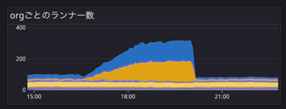

# サイボウズ生産性向上チームインターン2022の参加レポ
## 生産性向上チーム / 生産性向上コースについて
サイボウズさんは、おもにグループウェアを自社開発している会社です。kintone や Garoon といったサービスが有名です。
また、技術ブログなども積極的に執筆されており、お世話になることも多いです。
2022 のエンジニアインターンでは、Web サービス開発コースや、モバイルアプリコース、Kubernetes 基盤開発コースなどがあり、私は、そのなかの生産性向上コースのインターンに参加しました。

### 生産性向上チームとは
生産性向上チームの紹介：
[https://note.com/cybozu_dev/n/n1c1b44bf72f6](https://note.com/cybozu_dev/n/n1c1b44bf72f6)

エンジニアはシステムを作って一般の業務の効率を上げることが多いですが、生産性向上チームは「エンジニア」の業務の効率を上げることが目的のチームです。
テストサーバーや認証系ツールなど、チームを横断した開発基盤の整備をしたり、ほかのチームへアドバイスをしたり、それら二つを達成するための情報収集などをしています。
生産性向上チームが実際に開発したものについては、以下のページに発表資料がまとまっています
[https://event.ospn.jp/odc2021-online/session/376878](https://event.ospn.jp/odc2021-online/session/376878)

### 生産性向上コースについて
2022 のインターンの概要です。
[https://cybozu.co.jp/company/job/recruitment/intern/improvement.html](https://cybozu.co.jp/company/job/recruitment/intern/improvement.html)

生産性向上コースは、5/23 ~ 6/6 の応募期間があり、書類選考と面接を経て参加が決まりました。

8月29日(月)〜9月2日(金) と 9月12日(月)〜9月16日(金) の期間があり、それぞれ 2 名ずつの参加でした。待遇は、5日 * 8時間 のインターンで 10 万円もらえました。
期間中は、オンラインで zoom をつないで、モブプロ形式で業務をすすめました。また、業務用PC (Mac) が貸与されました。
求められる技術は、UNIX の操作や、Git / GitHub の使用経験と、基本的なプログラミングの経験。推奨される技術は、CI / CD やテスト、仮想化技術、クラウドサービス、監視などでした。

## 参加するまで
インターンに参加したきっかけから、選考終了までの流れです。
### 応募
夏に参加するインターンを探していて、サイボウズさんの名前で検索をかけたのが知ったきっかけでした。サイボウズさんの名前自体を知っていたのは、ブログなどでたまに見かけることがあったからだと思います。
生産性向上チームは、インターンの応募ページで初めて知りました。ほかの企業を含め、フロントエンドやバックエンドの開発の内容が多いなか、インフラ寄りの内容を新鮮に感じ、また、インフラや DevOps などに興味を持っていたので応募することにしました。

### 選考
書類選考は、志望理由や自己PR、ポートフォリオの提出など簡潔なものでした。
書類選考の合格通知後、面接の日程調整をしました。

面接では、前半は人事の方と、後半はエンジニアの方と話をしました。人事の方ともエンジニアの方ともとても話しやすかったです。
書類選考で書いていたアピールポイントを丁寧に聞いてもらえたので、自分の経験をあますことなく伝えられた気がします。とくに、自分はインターンよりも大学のサークルでの経験が大きいので、サークルのことも結構きいてくれたのがありがたかったです。（以前受けた面接では、サークルよりも企業でのバイトの経験の方を重視されていたようで、あまり感触がよくなかったので）

また、どんなエンジニアになりたいかという話をしたときに、「全体像を理解していて、必要なときに専門的なところに入っていけるような人」と答えたら、エンジニアの方が強く共感してくれたのが印象的でした。

その後、合格通知をいただき、9月12日(月) 〜 9月16日(金) の期間で参加させていただくことになりました。

## 業務内容について
インターン期間では、生産性向上チームの方があらかじめ選定していたタスクから、興味のあるものを選ばせていただきました。
### 目標
選んだタスクは、「GitHub Actions セルフホストランナーが関係ないタスクでも無駄にインスタンスを立ち上げてしまうため、インスタンス起動の条件を設定する」というものでした。GitHub Actions セルフホストランナーの説明は後でします。
最終的な目標としては、条件を設定するだけです。しかし、その条件を追加するために、モジュールのバージョンを上げるなどの付随するタスクがいくつかありました。

### GitHub Actions セルフホストランナー
↓説明スライド
[https://www.slideshare.net/miyajan/github-actions-250042631](https://www.slideshare.net/miyajan/github-actions-250042631)

また、↓の図は、インターン生へのタスク説明のために社員の方が作ってくださった図です。
  

まず、GitHub Actions とは、GitHub が提供する CI / CD サービスで、リポジトリへの push や merge などのアクションと、テストの実行やデプロイなどのジョブを手軽に連携できます。
クラウドで提供されていて、ほかにツールを使わなくても、yml ファイルをリポジトリにおけば CI / CD が手軽に実行できて便利です。
[https://docs.github.com/ja/actions](https://docs.github.com/ja/actions)

このクラウド版で提供されている GitHub Actions ですが、CI / CD を実行するサーバー（ランナー）を自分たちが管理するサーバーにセルフホストすることが可能です。
サイボウズでは、おもに社内ネットワーク内のみでしか実行できないテストをしたいという理由から、このセルフホストランナーを運用しています。そして、それを管理しているのが生産性向上チームです。

また、ただセルフホストランナーを登録するのではなく、ジョブの数に応じて自動でランナーを立ち上げてプールしたり、削除したりしています。この仕組みは AWS 上に構築されており、ランナーとして EC2 が動いています。
そして、GitHub Actions でジョブを実行すると、すでにプールされているランナーのひとつが割り当てられてそのジョブ用に使い捨てられるのと同時に、次のジョブに備えて新しいインスタンスが起動され、プールされます。

このインスタンスの起動などは、lambda によって行われるのですが、その構成は terraform によってコード化されています。terraform は、宣言的な言語でインフラの構成をコード化できるツールです。AWS や GCP などのサービスに対応しており、AWS provider などを設定することで利用できます。

今回のタスクは、おもにこの terraform をいじることでした。

## 実行時ログ
ここからは、実際に作業したときの様子です。なお、インターン生二人が terraform に慣れていなかった（私は terraform という名前を聞いたことがあるくらいだった）ため、0 個目のタスクとして、terraform に慣れるための簡単なタスクを見積もってもらっています。
### staging / production をわけた
既存の定義ファイルではstaging / production 環境のリソースが同一ファイルに定義されていました。それを staging / production ディレクトリに分割することから作業を始めました。目的としては、staging / production の AWS provider と依存するモジュールのバージョンを別々に上げたかったからです。いきなり本番を上げるのは怖いですからね。

このとき、単純にフォルダだけを分けると、既存のリソースが一度破壊されてしまいます。というのも、terraform は state ファイルというもので現在のリソースの状況を把握しており、この state ファイルはプロジェクトごとに生成されるものだからです。
staging / production を分けると、既存のプロジェクトからはリソースを削除したように認識され、ファイルの構成と実際の環境を同期したとき（この同期は`terraform apply`というコマンドで実行されるので、以降 apply するといいます）に、それらのリソースが削除されてしまい、ダウンタイムが発生してしまいます。

ダウンタイムが発生するのを避けるために、既存のプロジェクトから新しい staging / production のプロジェクトに state を移動させるという方式をとりました。具体的には、`tarraform state mv`コマンドを使いました。
[https://www.terraform.io/cli/commands/state/mv](https://www.terraform.io/cli/commands/state/mv)

このコマンドを使うことで、既存のモジュールの state ファイルから、ほかのモジュールに state を移動させることができます。このように、設定ファイルとともに、それに紐づいた state も移動させることで、ダウンタイムをなくすことができました。

staging / production は同じプロジェクト内で管理されてたとはいえ、データ自体は分かれていたので、楽に移動させることができました。

### AWS provider / terraform-aws-github-runner のバージョンを上げた
次に、必要な機能を使えるようにするために AWS provider / terraform-aws-github-runner のバージョンを上げました。terraform-aws-github-runner は、philips-labs が提供するモジュールで、GitHub Actions をセルフホストするときに、terraform でいい感じにするモジュールです。

具体的にやることとしては、staging でバージョンを上げてみて、大丈夫だったら production のバージョンをあげるという流れでした。実際にコードを書き換える部分としては、それぞれのバージョン指定の部分を書き換えるだけでした。

ただ、大変だったのが、バージョン変更に伴う差分の確認でした。AWS provider は 3 系から 4 系への更新、terraform-aws-github-runner も 0 系から 1 系への更新という、どちらもメジャーアップデートだったので、`terraform plan` を実行すると、staging の時点で差分が 3000 行になりました。

できれば、provider と モジュールのバージョン更新は別にしたかったのですが、terraform-aws-github-runner のメジャーアップデートが provider のメジャーアップデートに依存していたため、不可能でした。
結局、3000 行の差分を目視で確認していくことになったのですが、そこで活躍したのがシェル芸です。3000 行の差分には、異なる Github Organization に適用される、内容的には重複する差分がありました。
それを、`cut`や`grep`などを使って整形して、`sort -u`などでいい感じに弾いてあげることで、実質的には数百行程度（記憶があいまい）の差分の確認で済みました。

差分を確認したところ、実際に変更されるものとしては、lambda リソースの置き換えなど危険なものはなさそうでした。そのため、特別に対応することなどもなく、確認した後に`terraform apply`を実行しました。そして、staging 環境でテストが正常に動いているのを確認した後、production 環境でも`terraform apply`をしました。

### 障害対応をした
staging / production ともにバージョン更新を適用したあとのことです。
社員の方が DataDog のダッシュボードを見て、staging の m5.large のランナーが 100 台ほど起動されていることに気が付きます。
本来なら、GitHub Organizationごとに30台に上限が設定されているので、正常な動作ではありません。このままインスタンスが無制限に起動されれば、クラウド破産も近いです。

↓は、実際にランナーの数が増えている図です。
staging では、2 つの GitHub Organization を運用していたので、その Organization のインスタンスが増加している様子がわかります。
  

ということで、障害対応が始まりました。

まず、変更の切り戻しを行おうとしました。具体的には、該当の commit を revert して、再度`terraform apply`をするというものです。しかし、これが失敗します。理由としては、AWS provider を 3 系から 4 系に更新した際に、4 系にしか存在しないリソースが新たに追加されていたためです。3 系にダウングレードすると、認識できないリソースが発生してしまうため、schema error で`terraform apply`ができませんでした。

この時点で「やばそうだな」という雰囲気が漂い始め、切り戻しの方法を探るチームと原因を探るチームに分かれます。

このときに発生していた問題を整理すると、以下のようなものでした。

- staging のランナーの数が、本来設定されている上限をこえている
- production のほうは、更新を適用したばかりなので現在異常はないが、今後 staging と同様に増加する可能性がある
- バージョンを下げて変更を切り戻しするということができない
- CI / CD は正常に起動され実行されている

#### バージョンを下げて変更を切り戻しするということができない
この問題に対しては、二つの次善策が検討されていたと記憶しています。
一つは、EC2 を起動する lambda が実行されないように、API Gateway の通信を止めるという案です。これにより、料金の増加は回避できます。
もう一つは、terraform で管理するリソースをすべて壊して、再度バージョンを下げた状態で`terraform apply`を実行するという案です。強引ですが、これにより、切り戻しが可能です。
結局、一つ目を実行して、二つ目を実行する前に原因が判明しました。

#### staging のランナーの数が、本来設定されている上限をこえている
表面的な原因は、ランナーを起動する lambda のスクリプトが、現在起動されているランナー数をうまく把握できていなかったことでした。つまり、ランナーがすでに起動されているにも関わらず、まだ起動されていないと判断していたため、新しいインスタンスを起動していたのです。

lambda は、現在起動しているランナーをタグのようなものをつけて管理していました。そのタグのつけ方が、バージョン変更に伴って変わっていました。本来ならば、新しいタグのつけ方に対応した lambda が使われるはずなのですが、なぜか前のバージョンの lambda が使用されていました。

なぜ古い lambda が使われていたのか、という理由は、究極的には terraform の AWS provider のバグを踏んだというものでした。これを説明するには、lambda の差分が発生したときの更新手順を説明する必要があります。

バージョン変更などに伴って lambda の変更が発生した場合、新しい lambda のファイルを手動で S3 にアップロードする必要がありました。これを現在の手順では、ローカルでシェルスクリプトを実行して行っていました。

しかし、今回実行した手順において、一度だけ、新しい lambda のアップロードをしないまま、`terraform apply`をしてしまっていたのです。このときは、エラーが出て、「あぁ、lambda のアップロードをしていなかったね」で終わっていました。実際、lambda をアップロードしたあとに再度`terraform apply`をすると、ログは正常だったのです。
実は、このとき以下の issue のバグを踏んでいました。内容的には、`terraform apply`が失敗してエラーが発生しているにも関わらず、実際の state が更新されてしまっている、というバグです。
[https://github.com/hashicorp/terraform-provider-aws/issues/25886](https://github.com/hashicorp/terraform-provider-aws/issues/25886)

初回に最新版の lambda が存在しない状態で、`terraform apply`をしたときに、エラーが発生しているにも関わらず、古いほうの lambda を使って state が更新されていたこと。そして、最新版の lambda をアップロードしたあとに再度`terraform apply`をしたときは、すでに lambda のファイルがあるものとされて、更新されなかった、というのが詳細な説明です。

結局、最新版の lambda のファイルを手動でアップロードして、正常に動くようになりました。

「CI / CD は正常に起動され実行されてい」たのは、GitHub Actions へのランナーの登録はうまくいっていたためです。問題の所在は、lambda がうまく上限数を管理できていなかったことでした。

「production のほうは、更新を適用したばかりなので現在異常はないが、今後 staging と同様に増加する可能性がある」という予想は当りませんでした。production 環境で、`terraform apply`をしたときは、最新版のファイルがアップロードされていたためです。

ひとつ前の staging / production を分けるというタスクとのつながりで見ると、staging / production を分けたにも関わらず、結局 staging の異常に気付かなかったという点に関しては微妙な結果になりました。
おそらく、staging に変更を適用したときに、CI / CD が正常に起動するだけでなく、ランナーの上限がうまく動いているかなどまで確認するべきだったのでしょう。（おそらくインターン最終日で時間がなく、切りのいいところまでと思って production への適用を急いだのもあると思います）

一方で、production では正常にインスタンスの上限を管理できていることから、staging / production での適用手順の差異を考えて、原因を素早く発見できたという面もあります。結果論でいえば、分けた意味もあったのでしょう。

それにしても、エラーが出た場合は変更が行われないことを期待しますから、ほんとうに辛いバグですね。

### その他
本来ならこの後に、実際にインスタンスが起動される条件を変更してみるというタスクや、datadog をいじってみるというタスクがあったのですが、時間切れでできませんでした。

業務以外にもイベントのようなものがありました。
初日の午前中にオリエンテーション、最終日に成果発表がありました。また、生産性向上チームが毎週開催している [#cybozu_productivity_weekly](https://twitter.com/hashtag/cybozu_productivity_weekly?f=live) に参加したり、ほかのチームの方がしゃべる勉強会やトークセッションを見たりしました。
毎日の最初と最後には、進捗報告や振り返りがありました。

## 感想
インターンに参加して、私が感じた感想を書いていきます。

### 業務内容について
なんといっても、障害対応に参加できたのが一番よかったです。チームの皆さんには申し訳ないですが、本当によかったです。

たとえば、現在発生している問題を簡単に整理して、それぞれに対処するようにチーム分けをしていたこと。ほかの人がやっていないことを見つけて「～～をやります」といって自律的に作業しつつ、協調を保ったままでいること。原因がわかったあとに問題を再現する手順を作って実行し、きちんと検証することなど、さすがプロの人たちだなと思うことが多かったです。
また、作業時にグループウェアにログをつけていたのですが、それが実際に活用されていたのを見れたのもよかったです。小並感がありますが、作業時の記録をつけるのは大事だな、と再認識しました。

ちなみに、私は障害のときに障害対応の実況スレを作っていました。
自分が所属するサークルでは、自分が原因究明のために手を動かすパターンがほとんどなので、記録する側に回れたことも新鮮でした。
そして、記録する側も作業者と同じレベルの知識をもっていないと記録なんてできないな、というのを体感しました。平時ならわからないことは聞けばいいのですが、障害対応という有事で忙しいなかで質問なんてなかなかできないですから。そして、理解できていないことについて実況の記録を書くことなんて無理です。

もちろん、障害対応以外にもよかったところは多くありました。
とくに大きかったのが、行き当たりばったり感です。これは悪い意味ではないです。

インターンや講習会などの特別な場では、時間の制約があることも多く、あらかじめ主催者側がそのタスクが完遂可能かや、どのような問題が発生し解決する方策は何か、などを調査したうえで課題が提供されることがあります。そのように提供されたものは、うまく動いて気持ちよく終われると思いますが、問題が発生した場合への対応という経験は身に付きにくいです。
今回、私たちが選んだタスクは、目標はある程度決められていましたが、実際の手順までは細かく調べられていませんでした。生産性向上チームの人も、とりあえずやり始めてみて、なにか問題が発生したら考えるというスタンスでした。そして、実際にいくつかの問題が発生しました。たとえば比較しなければいけない差分が 3000 行になるなどです。
このようなときに、実際にリアルタイムで社員さんと一緒に行き当たりばったりに考えながら、課題をどのように切り分け、どのように調査していくかの方針を立てることができたのは、いい経験になりました。

### モブプロについて
モブプロとは、実際にコードなどをいじるドライバーを一人おいて、ほかの人たちはその画面をみながら指示を出してコードを書いていくやり方です。

いろいろ流派があるようですが、生産性向上チームでは、ドライバーの人がある程度自走しつつ、わからないところがあれば聞く、あるいは検討するべき点があれば見ている側が話しかけるという方式をとっていました。

これだけ聞くと、一番下のレベルの人に合わせてしまい、効率が落ちそうだと思うと思います。私もそうでした。
実際にやってみても、たぶん一番できる人が一人でやったほうがコードを書く最大瞬間風速は上がるだろうな、とは思います。一方で、数週間、数ヶ月、数年単位で考えていくと、モブプロをしているほうが安定して速度を出せるだろうな、という感覚を得ました。

特に、エンジニアは知識が個人に依存するので、他業種にくらべて転職も多いように思います。人はいなくなる、ということを考慮に入れて考えると、実際にリアルタイムでできるエンジニアと思考を共有しながら学べるモブプロは、人材育成と知識共有という面から効果的な方法だと感じました。

もちろん、モブプロで育成や知識共有をするためには、気軽に質問できる、質問できるための知識がある、などといった条件はあります。
私の場合でいえば、今回のインターンでのモブプロは、質問ができなくなるほどのレベル感でもなく、また気軽に質問できる環境であったため、良いモブプロを経験させてもらいました。

### 開発環境について
セキュリティの面からと、効率アップの面から、社員さんの開発環境を教えてもらうのは面白かったです。
セキュリティの面では、AWS のクレデンシャル管理と、mac の keychain の便利さを知りました。

数週間前にセキュリティキャンプに参加していて、セキュリティへの関心は高まっていたのですが、具体的なことはなにもしていない状態だったので、インターン後に自分の開発環境をセキュアにすることから始めました。そのときに、サイボウズさんでの AWS のクレデンシャル管理などを参考にさせてもらっています。
[https://zenn.dev/sasakiy/scraps/77cb62b5458b55](https://zenn.dev/sasakiy/scraps/77cb62b5458b55)

また、効率の面からは、便利な CLI ツールなどを教えてもらいました。とくに、starship と、fzf の便利さに打ち震えています。

すぐに使えそうなツールは自分の環境にインストールしてみたのですが、まだまだ慣れるのには時間がかかりそうです。
開発環境が固定されない（よくほかのサーバーに ssh などをする）業務についたとき、自分の環境をカスタマイズしすぎていると大変だろうな、と思ってあまり開発環境はさわっていなかったのですが、「そもそも本番サーバーとかにログインすることがおかしい」というチームの人の意見を聞いて、それもそうだな、と思いました。
ただ、やはりカスタマイズされていない環境にアクセスすることもあるとは思うので、ほどほどにカスタマイズされたいい位置を見つけて行きたいです。

dotfile という単語を教えてもらったので、検索が捗りそうな気がしています。
[https://github.com/sasakiy84/dotfiles](https://github.com/sasakiy84/dotfiles)

### サイボウズさんのサービスについて
インターン中にサイボウズさんに提供してもらったサービスについてです。

まず、なんといっても給料がいいです。日給二万はうれしすぎます。
そして、なんと給料に加えて、社員さんと一緒にご飯を食べた分だけ食事手当がつきます。しかも、この手当が積み立て方式なので、うまく金額を調整すると、最終日にめちゃくちゃ豪華なものが食べれます。私は、寿司出前二人前とシャインマスカットを食べました。

また、貸与 PC もスペック的には申し分なく、細かいことですが type C の変換ケーブルがついてきました。普段 type C をあまり使っておらず、貸与 PC が mac なら変換ケーブルを買わなきゃ、と思っていたので、ありがたかったです。
さらに、ノベルティとしてモバイルバッテリーなどもいただけました。至れり尽くせりですね。

インターン生についての話ではないのですが、社員さんになると技術書購入の補助があるというのも魅力的でした。物理本、電子本問わず買えるそうで、うらやましい限りです。

### 雰囲気について
生産性向上チームでは、25 分作業をして、5 分休憩という方式をとっています。この休憩時間の間に雑談をいっぱいさせてもらいました。とても楽しく話させてもらいました。
また、成果発表のときなどは、kintone で実況スレがたち、いっぱいコメントをして盛り上げてもらいました。オンラインでのインターン、リモートワークでも、うまくコミュニケーションがとれるということを感じました。

## 感謝
お世話になった生産性向上チームや人事の方々に感謝です。貴重な経験をさせていただきました。

