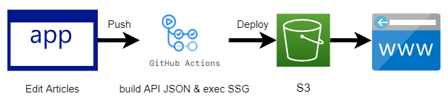

# ブログを作った
## このブログを作った目的

- 他人に気軽に情報を共有できるように
- 自分が外出先などで気軽に情報を見れるように
- 技術的な素振り

## 全体構成図



S3 からすべてのファイルを配信する形式。記事の全件を取得する API なども、ビルド時に事前に生成しておいた json ファイルを使う。
CI/CD は GitHub Actions を使い、master ブランチに push されれば自動でデプロイするようにした。

## ブログ機能の紹介（推しポイント）

個人的に、知識をため込んだテキストなどは DB に保存などではなく、テキストファイルのまま持っておきたい。バックアップが容易だし、git で差分管理もできる。シンプルな形式であるため、移行時にエクスポートやインポートの方法で頭を悩ませることもない。
知識を集約しておく手段としては、Notion などの有名サービスを使うという選択肢もある。しかし、編集などの作業は [Obsidian](https://obsidian.md/) というソフトウェアで満足している。Obsidian は、ローカルで編集できて、Markdown Preview や、 プラグインのインストールなどができて高機能だ。しかし、実態としては Markdown ファイルなので、容易に維持ができる。
一方で、 Obsidian を使っていて困るのが、他人と共有するときや、外出先でスマホから見るときだ。Obsidian が提供する Publish 機能や Sync 機能もあるが、お金がかかるため、敬遠していた。

ちょうどインターンや就活が始まり、制作物を提出して選考を受けることが増えてきたので、他人と共有するためのブログサイトを作ってみようとしたのが、このサイトだ。
また、文書管理ツールにはもとから興味があり、自作したいと思っていたので、ちょうどいい機会だった。

というわけで、ある程度こだわりながら作った＆これから作っていくつもりなので、いくつかの推しポイントがある。

### Markdown テキストをシステムの中心に据えたポータビリティ

前述した通り、テキストデータは Markdown 形式のまま保持しておきたい。一番シンプルで、ポータビリティがいいからだ。
このブログでは、記事を Markdown 形式で書いて、それをファイルサーバーにアップロードする。そして、それを直接 GET するという形式をとっている。こうすることで、高い表現力とポータビリティを維持できる。

### SSG を使用したサイトパフォーマンス

ネットサーフィンをしているときに、動作の重いページにぶつかると、そのページの印象が下がる。閲覧するだけなんだから、サクサクで動いてほしい。
という願望があるので、SSG(Static Site Generation) を使って、静的ファイルをホスティングする形にした。~~Page Speed Insight でも 90 点台だし、自分で使ってる感じもサクサクで満足。~~
そういえば、SSG のときに API からデータをとってきて埋め込んでも、クライアントではデータが空だから CLS が発生するんだった。これは気に入らないので、どうするか検討中。

## 技術スタックと選定理由

使用したフレームワークなどのうち、目ぼしいものを紹介する。

### Vue3 + Vite

使ってみた感想は以下のような感じ

- やっと Vue + TS に人権が出てきた
- React にもあるけど、 Suspense 面白い。
- ライブラリ群も普通に充実してる

また、爆速という噂の Vite も試してみた。開発時にバンドルをしないことで開発者体験をアゲアゲにできる、という理解をしている。
そこまで大きなコードではないため、あまり有用性を実感できていない。しかし、SCSS の導入がとても便利だったことや、SSG の導入も比較的楽だったこと、以前ほかのコードで Jest と Vitest で同じテストを実行したときに Vitest がとても速かったことなどから、可能性はとても感じている。

#### Vue or React or Svelte

Vue3 のリリースから時間がたって、そろそろ Nuxt3 が本格的に使えそうになってきてる。個人開発で使われているフロントエンドでのメインフレームワークは、自分の観測範囲だと React / Vue / Svelte と、それらをベースにした Nuxt / Next などが人気に見える。

[https://2021.stateofjs.com/en-US/libraries/front-end-frameworks](https://2021.stateofjs.com/en-US/libraries/front-end-frameworks)

今回は、そこまで高度なことをするわけでもない小規模開発であることから、フレームワークの機能による比較というよりは、自分個人の事情から Vue を選んだ。
自分個人の事情とは、

- 時間に余裕があるわけではないので、今まで使ったことがない Svelte はパス
- Vue は今まで一番使ってきたが、すべて Options API だった。そろそろ Composition API にデビューしておきたいため、 React より Vue への興味が勝った

### markdown / unified

Markdown を HTML に表示するときに使うライブラリ。AST(Abstract Syntax Tree) を操作するエコシステムとして、unified というものが存在する。

- source -> AST
- AST -> AST
- AST -> output

というように、処理の段階が分かれている。そして、それぞれの段階に対応した多様なライブラリがあるので、拡張性が高い。
また、AST については言語関係のシステムを作るに当たって、ありえん有用そうな概念。自分は言語関係のシステムに興味があるので、できるだけ低レベルなものを触っておきたかった、という理由もある。

#### unified or markdown-it

JS 界隈で Markdown を扱うときは、 markdown-it がデファクトスタンダードっぽい。
そこで、まずは markdown-it を使うことを考えたが、「markdown-it は HTML 出力に重きをおいているのに対して、unified は AST centered であるため、自由度が高い」という噂を聞いて unified にした。
おそらくどちらもある程度完成されているので、高度なことをしてみないと実際にどっちがいいかはわからないとは思う。

### vite-ssg

vite で SSG をするなら、これ一択っぽい？
使ってみた感じ、機能は揃っており、やりたいことはできた＆できそうな感じがした。
導入自体はとても簡単。また、設定項目もほしいものが揃っていた。例えば、S3 ではフィアルをホスティングするときに、 `/path.html` ではなく `/path/index.html` を生成しなければならないが、コンフィグのパラメータを一つ指定するだけでそれができた。
ほかにも、メタタグを設定するライブラリが内蔵されていたりと、使いやすかった。

### GitHub Actions + AWS S3

GitHub Actions は、特定のタイミングで実行されるタスクを定義できるサービス。例えば、 staging branch に push されたときにテストを走らせるとか。
また、AWS S3(Amazon Simple Storage Service) はファイルストレージサービスで、公開設定を行えば、静的ファイルのホスティングサービスとしても使える。今回は、SSG をしているので、ホスティング先は S3 で十分。お金も全然かからない。
S3 へは、AWS CLI とよばれるコマンドラインツールでファイルをアップロードできる。そのため、GitHub Actions でタスクを定義して、master branch に push されると、自動でサイトが更新されるようにした。
また、Cloud Formation という AWS のサービスを使って、S3 の設定をコードに落とし込んだ。正直、今回だけを考えると手動で設定したほうが楽だが、Cloud Formation の勉強と 今後の拡張性を考えてやった。

### 独自ドメイン + Cloud Flare

ドメインを Cloud Flare でとった。DNS もそのまま Cloud Flare を利用。`CNAME` レコードを設定して、S3 に通信を飛ばすようにした。
まだ、Cloud Flare のほかの機能は使っていないが、いろいろできるっぽいので楽しみ。

## 作成時のログ

制作時のメモ残し的なかんじ

### ESM import

マークダウンのインデックスを集めて API 用の json を生成する & articles ディレクトリから public ディレクトリへマークダウンファイルを移動させる、というタスクをビルド時に実行している。この TS ファイルを ESM 形式で書いていたら実行のときに ESM 関係のエラーが出た。
具体的には、`tsc`コマンドを使って`build.ts`をコンパイルし、`build.js`を実行するときに、`build.ts`から読み込んでいた util 系のファイルが`cannnot find module`になってしまう。
理由は以下の通り。ESM の TS ファイルでは、import 文に拡張子をつけないことが推奨されている。例えば、`util.ts`をインポートするときは、こんな感じで書くことがいいとされている。

```ts
import { a } from "./util";
```

このインポート文は、コンパイル後に自動で`./util.js`に変換されるわけではなく、そのままである。一方で、`node`コマンドは、デフォルトでは ESM 形式の拡張子なしインポートに対応していない。
そのため、拡張子がないファイルを読み込もうとして`cannnot find module`になる。

解決策としては、

```
import { a } from "./util.js"
```

のように、コンパイル後のファイルパスを書くという方法と、

```
node --es-module-specifier-resolution=node
```

のように、ESM の拡張子なし記法を理解させるフラグを実行時につける、という方法がある。
コンパイル後のファイルパスをコンパイル前のファイルに書くのは保守性が下がると思ったので、今回は後者を採用した。

参考リンク
[Compiled JavaScript import is missing file extension](https://github.com/microsoft/TypeScript/issues/40878)

### Heap Out Of Memory in TS Template literal

作成日・更新日のフィールドを作成したときに、TS のテンプレートリテラル機能を使って、文字フォーマットの確認をしようと思った。日付のフォーマット型は以下のように書ける

```ts
type oneToNine = 1 | 2 | 3 | 4 | 5 | 6 | 7 | 8 | 9;
type zeroToNine = 0 | 1 | 2 | 3 | 4 | 5 | 6 | 7 | 8 | 9;

type Year = `20${zeroToNine}${zeroToNine}`;
type Month = `0${oneToNine}` | `1${0 | 1 | 2}`;
type Day = `${0}${oneToNine}` | `${1 | 2}${zeroToNine}` | `3${0 | 1}`;

export type YearMonthDay = `${Year}-${Month}-${Day}`;
```

しかし、これでビルドしようと思ったら（正確には、`vue-tsc --no-emit`を実行したら）以下のようなエラーが出た。

```
$npx vue-tsc --noEmit
FATAL ERROR: Ineffective mark-compacts near heap limit Allocation failed - JavaScript heap out of memory
```

どうやら、テンプレートリテラルが表現する文字列がありすぎて、メモリがなくなったらしい。この記法はいろんなサイトに載っているから、普通に使えると思うんだけど、なんでだろう。

解決策としては、

```bash
NODE_OPTIONS=--max_old_space_size=4096 npx vue-tsc --noEmit
```

という風に、node のメモリオプションを指定してあげればいい。が、markdown を書いているときに型注釈をつけれるわけでもないので、そこまでする必要もないか、と思った。

### is not exported by \_\_vite-browser-external その一

SSG のときに、vite のエントリーポイントである `main.ts` でローカルファイルを読み込みたかった。マークダウンのメタ情報を集約した API 用の json ファイルを作るためである。
単純に`main.ts`内に書くと、

```
ReadDir is not exported by \_\_vite-browser-external
```

というエラーが出る。`vite-browser`という特殊な環境で読み込めるモジュールじゃないと使えないらしい。解決方法としては、`vite.config.ts`に記述できる`vite-ssg`の`includeRoutes`フックを使えばローカルファイルを読み込みできた。

### is not exported by \_\_vite-browser-external その二

dynamic routing のページに、title や　 description などのヘッドタグを動的に設定しようとしたときに`is not exported by __vite-browser-external`が再び発生した。理由は、メタ情報を得るために、ローカルファイルのマークダウンを読み込もうとしたから。
「その一」のときは、専用のフックが用意されていたが、ページコンポーネント内部に干渉できるフックは用意されていなさそうだった。おそらく、nuxt の `asyncData` とかでもローカルファイルへのアクセスはできない気がする。

`vite-browser` ということなので、`fetch`や`axios`は使えるかな、と思って試してみたら使えた。なので、github actions のワークフローでは、SSG の前に S3 にマークダウンファイルをアップして、SSG のビルド時にはページコンポーネントのメタ情報を S3 からフェッチしてくることにした。

### S3 の公開設定

S3 の公開設定のときに、バケット名を独自ドメインと同じ名前にしなければいけない理由について。同じにする必要があることを言っている記事はあっても、その理由に触れている記事は少なかったため（まあドキュメントに書いてあるんだけど）
AWS S3 は、HOST ヘッダを見てバケットを判断しているっぽい。[参考](https://docs.aws.amazon.com/ja_jp/AmazonS3/latest/userguide/website-hosting-custom-domain-walkthrough.html#root-domain-walkthrough-create-buckets)
例えば、「バケットウェブサイトエンドポイント」で設定されているエンドポイントに、HOST を変えた以下のコマンドでアクセスする。

```
curl -H "Host: wowow.com" http://blog.sasakiy84.net.s3-website-ap-northeast-1.amazonaws.com
```

すると、

```
404 Not Found
Code: NoSuchBucket
BucketName: wowow.com
```

という結果が返ってくる。
